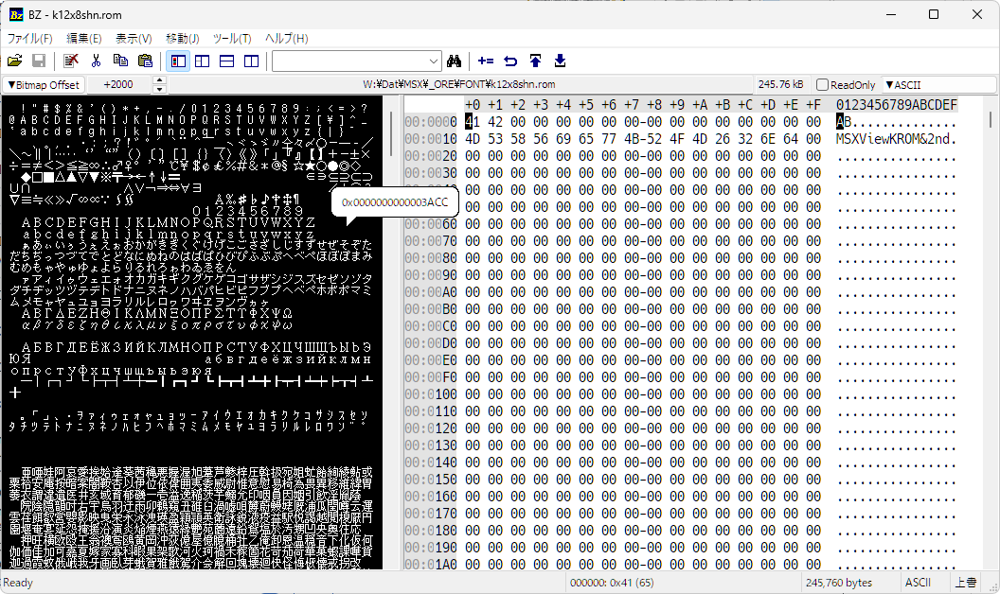
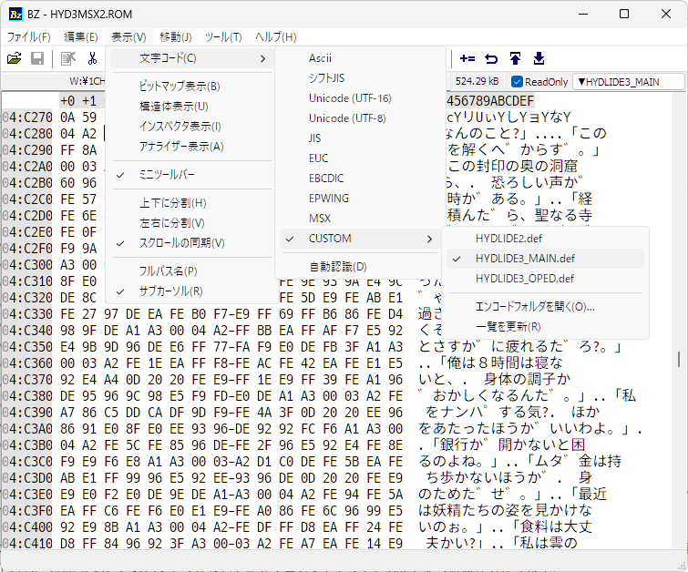
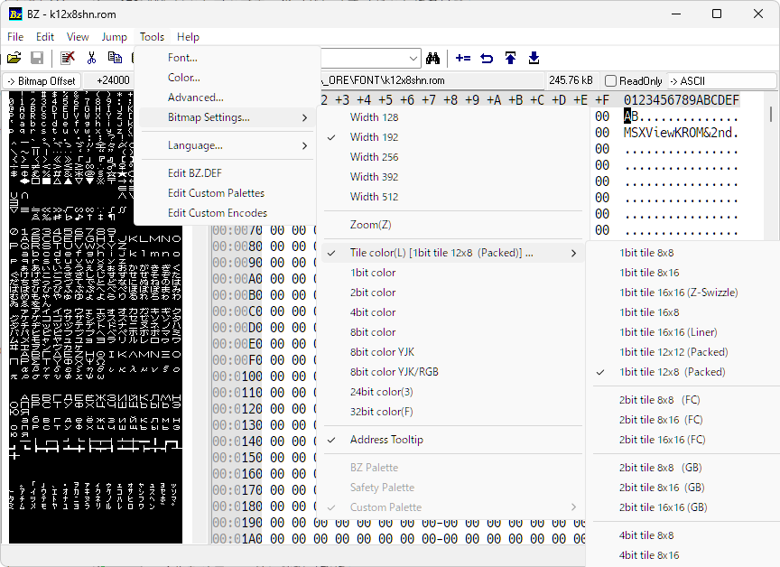
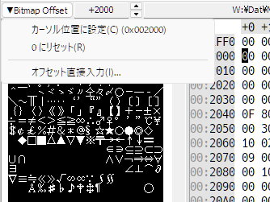

#  Binary Editor Bz - MSX Custom

Binary Editor Bz - MSX Users Custom Version 1.9.9.7

[c.mosさん](http://www.vcraft.jp/)作、[Binary Editor Bz](http://www.vcraft.jp/soft/bz.html)の[tamachanさんの改造版](https://gitlab.com/devill.tamachan/binaryeditorbz)をベースに、MSXユーザー向けの機能を追加した物です。

Windows版のみの提供です。

構造体表示機能や分割画面と比較、メモリのビットマップ表示機能があります。 

Binary Editor Bz for MSX は、MSX向けビットマップビュー拡張改造版です。

  - インストーラ―版 [BzEditor-1.9.9.7-for-msx.exe](https://github.com/uniskie/MSX_MISC_TOOLS/blob/main/BinaryEditorBz_for_MSX/BzEditor-1.9.9.7-for-msx.exe)
  - ポータブル版 [Bz1997Portable-for-MSX.zip](https://github.com/uniskie/MSX_MISC_TOOLS/blob/main/BinaryEditorBz_for_MSX/Bz1997Portable-for-MSX.zip)
  - 改変版ソースコードリポジトリ   
    https://gitlab.com/uniskie/binaryeditorbz-for-msx

- **追加機能以外の使い方/ オリジナルヘルプ**  
  https://devil-tamachan.github.io/BZDoc/



## 文字コード（テキストエンコード）

右側の文字表示エリアは**文字コード**が選べます。

本カスタム版ではMSX ANK文字とユーザー定義エンコードを追加しています。

文字列検索時は表示中のエンコードに従ってバイナリに変換し検索します。

| タイプ     | 解説                                   |
| ---------- | -------------------------------------- |
| ASCII      | ASCIIコードで表示します。              |
| SJIS       | シフトJISコードで表示します。          |
| UTF-16     | Unicode (UTF-16)で表示します。         |
| JIS        | JISコードで表示します。                |
| EUC        | EUCコードで表示します。                |
| UTF8       | Unicode (UTF-8)で表示します。          |
| EBCDIC     | EBCDICコードで表示します。             |
| EPWING     | EPWING(電子ブック)コードで表示します。 |
| **MSX**    | MSX ANKコードで表示します。            |
| **CUSTOM** | ユーザー定義エンコードで表示します。   |

## MSXエンコード用フォント

テキストエンコードが **MSX** の時、**FontForDump**か**MSX-FONT**で表示されます。

### MSX風フォントファイル

- **FontForDump.ttf**は、インストーラで当ソフトと一緒にインストールされます。  
    
  
  - ポータブル版の場合は同梱されている**Fonts/FontForDump.ttf** と **Fonts/FontForDumpN.ttf** を手動でインストールしてください。
- **MSX-FONT**は**FontForDump**が存在しない場合に使用されます。
- **FontForDump**も**MSX-FONT**もいずれもインストールされていなければ設定で指定したフォント（半角全角混じり）を使用します。
- 他のエンコードでは設定で指定したフォントになります。
- **MSX-FONT.tff**はbugfireさんの [**DumpListEditor**](https://bugfire2009.ojaru.jp/download.html)
に同梱されています。

## CUSTOM：ユーザー定義エンコード

独自のマルチバイトエンコード形式を定義して使用できます。

 `*.def` ファイルを作成し、`%APPDATA%BzEditor\CustomEncodes`  (ポータブル版は`CustomEncodes`) に配置してください。

メニューの「表示」 → 「文字コード」 → 「CUSTOM」 または、ミニツールバーの一番右にあるボタンから選べるようになります。


#### def ファイル 書式

```
; コメント
先頭キャラクタコード(16進数) (TABコード) 文字列
...
先頭キャラクタコード(16進数) (TABコード) 文字列


[マルチバイトの最初のキャラクタコード(16進数)]
先頭キャラクタコード(16進数) (TABコード) 文字列
先頭キャラクタコード(16進数) (TABコード) 文字列
...
先頭キャラクタコード(16進数) (TABコード) 文字列
```

#### CUSTOMエンコード定義サンプル定義サンプル

`%APPDATA%BzEditor\CustomEncodes` (ポータブル版は`CustomEncodes`) には、サンプルファイルもインストールされています。

##### 例） HYDLIDE3_MAIN.def



## ビットマップ表示の追加機能

ビットマップビューにMSX向けの機能を追加拡張しました。  
他に、ビットマップビュー周りのバグを修正しています。

- ビットマップビューは**表示**→**ビットマップ表示** で表示切替

- ビットマップビュー設定は**ツール**→**ビットマップ設定** または、**ビットマップビュー上で右クリック**



### MSX向けビットマップ表示の概要

- 1bit color 8x8 ... SCREEN 0,1,2,4 / SPRITE 8x8 / ANK FONT
- 1bit color 8x16  ... SPRITE 61x16
- 1bit color 16x8  ... ハイドライドⅢ MSX2版 FONT
- 1bit color 16x16(Z-Swizzle)  ... 漢字ロム
- 1bit color 12x12  ... MSX-Viewフォント
- 1bit color 12x8  ... MSX-Viewフォント
- 2bit color ... SCREEN 6,9
- 4bit color ... SCREEN 5,7
- 8bit coolor YJK ... SCREEN 10,11
- 8bit coolor YJK/RGB ... SCREEN 12
- width 256 / 512
- MSX16 (パレット)
- MSX256 (パレット)
- MSX_logo (パレット)

実験で以下のモードも実装しています。

- 2bit color FC
- 2bit color GB
- 4BIT color SFC/PCE
- 8BIT color SFC

### ビットマップ表示：MSX向け指定例

ビットマップ表示： 表示(V)→ビットマップ表示(B)

（Address Tooltipは意外と邪魔な時があるので、イラっとしたらOFFにすると良いです）

| カラー形式 | カラーパレット | 表示幅 | 表示用途 |
|---|---|---|---|
| tile/1bit color 8x8               | ---      | width 256 | SCREEN 0/1/2/4、8x8 SPRITE、FONT 8x8キャラ |
| tile/1bit color 8x16              | ---      | width 256 | 16x16 SPRITE |
| tile/1bit color 16x16 (Z-Swizzle) | ---      | width 256 | 漢字ROM |
| tile/1bit color 12x12 (Packed)    | ---      | width 192 | MSX-Viewフォント |
| tile/1bit color 12x8  (Packed)    | ---      | width 192 | MSX-Viewフォント |
| tile/1bit color 16x8              | ---      | width 256 | ハイドライド3 MSX2版 全角フォント |
| 2bit color                        | MSX_logo |width 512 | SCREEN 6/9、MSX起動ロゴ等 |
| 4bit color                        | MSX16    | width 256 | SCREEN 5 |
| 4bit color                        | MSX16    | width 512 | SCREEN 7 |
| 8bit color                        | MSX256   | width 256 | SCREEN 8 |
| 8bit color YJK/RGB                | MSX16    | width 256 | SCREEN 10/11 |
| 8bit color YJK                    | ---      | width 256 | SCREEN 12 |

### おまけ：特殊タイルモード

| カラー形式 | カラーパレット | 変換処理 | 表示用途 |
|---|---|---|---|
| tile/2bit color 8x8   (FC)      | GB_GRAY/GB_GREEN/GRAY4等 | 8x8 pixel (1bpp 8byte) x2プレーン | ファミコン BG/スプライト |
| tile/2bit color 8x16  (FC)      | GB_GRAY/GB_GREEN/GRAY4等 | 8x8 pixel (1bpp 8byte) x2プレーン | ファミコン BG/スプライト |
| tile/2bit color 16x16 (FC)      | GB_GRAY/GB_GREEN/GRAY4等 | (1bitx2) 8x8 pixel x2プレーン | ファミコン BG/スプライト |
| tile/2bit color 8x8   (GB)      | GB_GRAY/GB_GREEN/GRAY4等 | 行インターレース(1 line = 8bit x2) | ゲームボーイ BG/スプライト |
| tile/2bit color 8x16  (GB)      | GB_GRAY/GB_GREEN/GRAY4等 | 行インターレース(1 line = 8bit x2) | ゲームボーイ BG/スプライト |
| tile/2bit color 16x16 (GB)      | GB_GRAY/GB_GREEN/GRAY4等 | 行インターレース(1 line = 8bit x2) | ゲームボーイ BG/スプライト |
| tile/4bit color 8x8             | MSX16/MIO/GRAY4等 | 2bpp 8x8 tile | メガドライブ等 BG/スプライト |
| tile/4bit color 8x16            | MSX16/MIO/GRAY4等 | 2bpp 8x8 tile | メガドライブ等 BG/スプライト |
| tile/4bit color 16x16           | MSX16/MIO/GRAY4等 | 2bpp 8x8 tile | メガドライブ等 BG/スプライト |
| tile/4bit color 8x8   (SFC/PCE) | MSX16/MIO/GRAY4等 | 行インターレース(1 line = 8bit x2) x 8x8 pixel x2プレーン | スーパーファミコン/PCエンジン BG/スプライト |
| tile/4bit color 8x16  (SFC/PCE) | MSX16/MIO/GRAY4等 | 行インターレース(1 line = 8bit x2) x 8x8 pixel x2プレーン | スーパーファミコン/PCエンジン BG/スプライト |
| tile/4bit color 16x16 (SFC/PCE) | MSX16/MIO/GRAY4等 | 行インターレース(1 line = 8bit x2) x 8x8 pixel x2プレーン | スーパーファミコン/PCエンジン BG/スプライト |
| tile/8bit color 8x8   (SFC)     | MSX16/MIO/GRAY4等 | 行インターレース(1 line = 8bit x2) x 8x8 pixel x2プレーン | スーパーファミコン BG/スプライト |
| tile/8bit color 8x16  (SFC)     | MSX16/MIO/GRAY4等 | 行インターレース(1 line = 8bit x2) x 8x8 pixel x2プレーン | スーパーファミコン BG/スプライト |
| tile/8bit color 16x16 (SFC)     | MSX16/MIO/GRAY4等 | 行インターレース(1 line = 8bit x2) x 8x8 pixel x2プレーン | スーパーファミコン BG/スプライト |

### ビットマップ表示の表示更新について

バイナリデータの編集時、ビットマップビューがリアルタイムで更新されるようにしました。
重い場合はビットマップビューを閉じて編集してください。

### ビットマップ表示のアドレスオフセットについて

**Bitmap Offset**ボタンやその横にあるスピンボタンで、ビットマップとして表示するアドレスのオフセットが可能です。



**Bitmap Offset**ボタンを押すとポップアップメニューから
- 現在のカーソル位置で設定
- リセット
- 直接数値入力
を選択できます。

### パレットの編集

メニューの「ツール(T)」→「カスタムパレットの編集」  
で開くフォルダーにあるテキストファイル が、カラーパレット定義ファイルです。

（置いてあるファイル名がBITMAPビューの右クリックメニューから選べます。）

MSX向けに`MSX16.txt`、`MSX256.txt`、`MSX_logo.txt`を用意しましたが、
各自お好きな定義ファイルをを追加してください。

[追加パレットのみのセット](https://github.com/uniskie/MSX_MISC_TOOLS/blob/main/BinaryEditorBz_for_MSX/BZPalettes-for-MSX.zip)

## 変更履歴

- 2026/09/26 version 1.9.9.7
  - (追加)ビットマップビューの設定をメニュー：ツールからアクセスできるようにした
  - (変更)Contens(ヘルプ)をReadMe.htmlに変更
  - (追加)MSX ANK文字専用フォントの追加
  - (追加)ビットマップビューで開始オフセット指定機能追加
  - (追加)ビットマップビューで12x12、12x8のMSX Viewフォント対応を追加
  - (追加)CUSTOMキャラセット（エンコード）のファイル置き場を`%AppData%\BzEditor\CustomEncodes`に変更し、フォルダに格納されたファイルをメニューから選択可能に
  - (調整)ダンプビューのスクロールバーの移動量修正
  - (調整)ビットマップビューでのマウスホイール移動量を8pxまたは文字サイズ基準に変更
  - (調整)ビットマップビューでアドレスツールチップが邪魔にならない位置に移動
  - (調整)カスタムパレットをサブメニュー化
  - (調整)CUSTOMキャラセット（エンコード）をサブメニュー化
  - (調整)一部の長いコードをhファイルからcppファイルに移動
  - (バグ修正)クリップボードコピー処理修正（ダンプリストコピー、バイナリコピー、文字列コピーが機能しなくなっていた）
  - (バグ修正)クリップボード貼り付け処理修正（上書き時に追加になっていたり選択解除がされてなかったりした）
  - (バグ修正)テキストビュー幅の決定前に表示バッファを確保していたことによるメモリリークの修正

- 2026/09/13 version 1.9.9.6
  - CUSTOMキャラセットを追加  
    CUSTOM.defで独自のマルチバイトエンコードを定義可能  
  - フォント実測による文字表示処理と文字クリック処理に全面改修
  - 描画処理のちらつき対策でダブルバッファ化
  - サブカレットのバグ修正

- 2026/09/09 version 1.9.9.4
  - テキストビューのエンコードに「MSX」（MSXのANK文字）を追加
  - 内部をUNICODEベースに変更
  - ソースコードのエンコードをUTF-8に変更（SJISではトランプ記号等が書けないので）
  - ビットマップビューに 1bpp 16x8 (ハイドライド3 MSX2版 漢字フォント用)を追加

- 2025/05/27 version 1.9.9.1 
  - ビットマップビューにSFC用8bitタイル形式追加
  - カラータイプのタイル形式をサブメニューに移動
  - 4bit SFCタイル形式はPCEと共通なので文言変更
  - パレット定義ファイル名変更・追加
    - GRAY_GB → GB_GRAY
    - GREEN_GB → GB_GREEN
    - GRAY_2bit → GRAY4
    - GRAY_4bit → GRAY16
    - 新規追加 → GRAY256
    - 新規追加 → MIO

- 2025/05/25  
  - ビットマップビューにFC/GB/SFC/MD向け表示追加
  - カラーパレットフォルダ名をPalletsからPalettesに変更
  - ビットマップビューリアルタイム更新に変更  
    重い場合はビットマップビューを閉じて編集してください

- 2025/05/20  
  - ビットマップビューに 2bit color を追加  
  - カラーパレットに MSX_logoを追加  

- 2025/05/19  
  元からあったビットマップビューのバグを一通り修正  
  - アドレス←→スクロール位置変換式が相互に機能するように書き直し
  - データの取得でキャッシュヒットチェックが正常に機能していないのを修正
  - 元データが表示必要サイズに足りない場合に空きを足す処理を追加
  - モード切替での位置引継ぎとドキュメント読み込み時のリセットの使い分け

- 2025/05/18  
  MSX向け改造版公開  
  - 1bit color 8x8 （フォントやキャラ用）
  - 2bit color
  - 8bit coolor YJK
  - 8bit coolor YJK/RGB
  - width 512
  - パレットにMSX16、MSX256を追加

## 謝辞

元ソースコードはご厚意によって公開されている物です。  

[オリジナル版Readme](ReadMe_org.md)

Binary Editor BZ - original version -  
[Binary Editor BZ 1.6.2 Win](http://www.vcraft.jp/soft/bz.html) (New BSD License) --- Copyright (c) 1996-2004 [c.mos](https://www.vcraft.jp/index.html)

Binary Editor BZ - 改造版 -  
[Binary Editor BZ 1.9.8 Win](https://gitlab.com/devill.tamachan/binaryeditorbz/) (New BSD License) --- modify 1996-2004, 2012-2022 [tamachan](https://devil-tamachan.github.io/BZDoc/)

### ライセンス

当ソフトも継承元に準じて New BSD License で提供されます。
