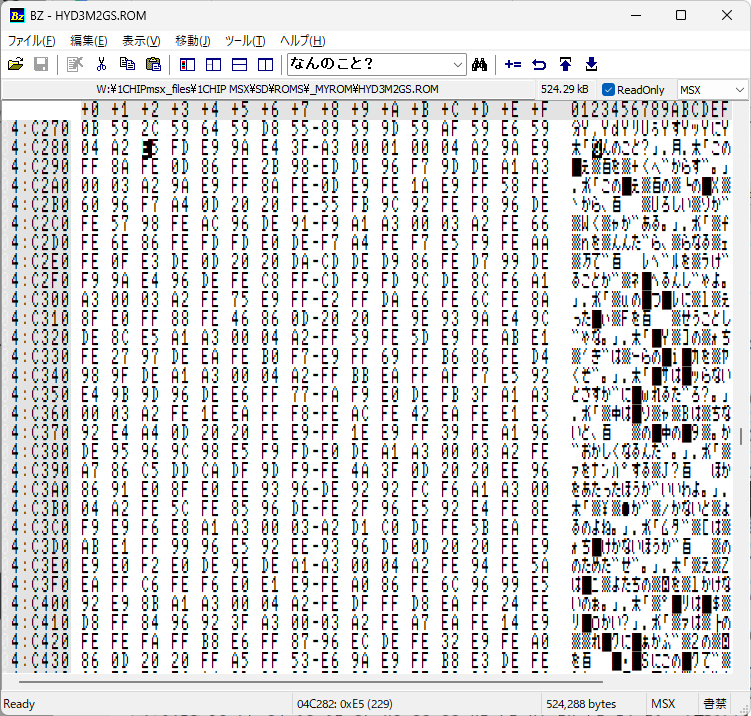
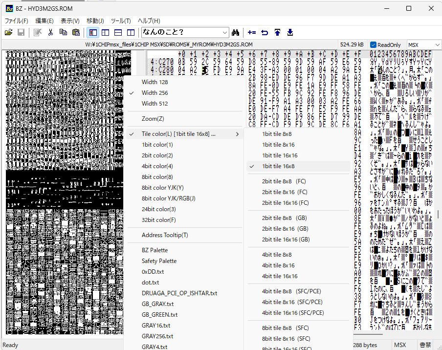
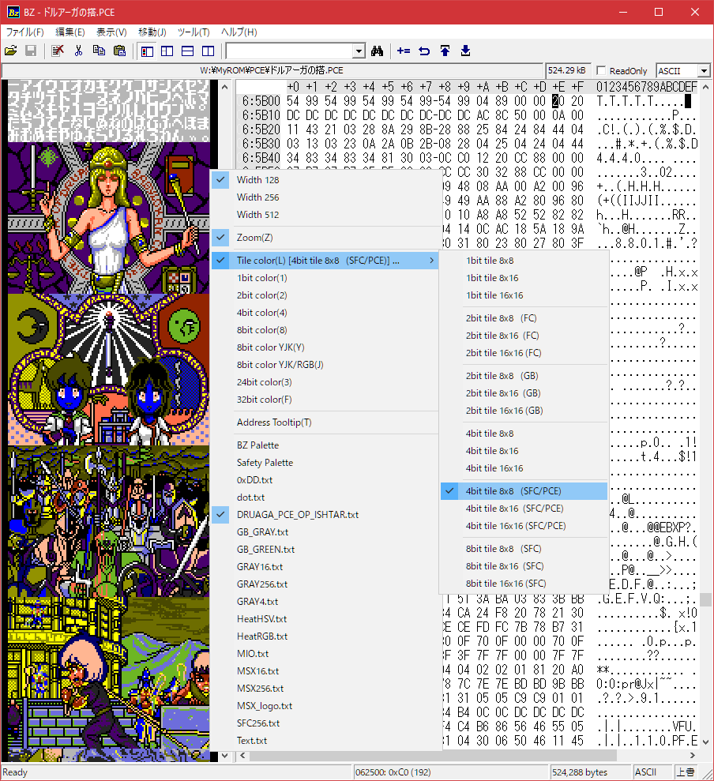

#  Binary Editor Bz / MSX User Custom

Binary Editor Bz for MSX Version 1.9.9.6

[c.mosさん](http://www.vcraft.jp/)作、[Binary Editor Bz](http://www.vcraft.jp/soft/bz.html)の[tamachanさんの改造版](https://gitlab.com/devill.tamachan/binaryeditorbz)をベースに、MSXユーザー向けの機能を追加した物です。

Windows版のみの提供です。

構造体表示機能や分割画面と比較、メモリのビットマップ表示機能があります。 

Binary Editor Bz for MSX は、MSX向けビットマップビュー拡張改造版です。

  - インストーラ―版 [BzEditor-1.9.9.6-for-msx.exe](https://github.com/uniskie/MSX_MISC_TOOLS/blob/main/BinaryEditorBz_for_MSX/BzEditor-1.9.9.6-for-msx.exe)
  - ポータブル版 [Bz1996Portable-for-MSX.zip](https://github.com/uniskie/MSX_MISC_TOOLS/blob/main/BinaryEditorBz_for_MSX/Bz1996Portable-for-MSX.zip)
  - 改変版ソースコードリポジトリ   
    https://gitlab.com/uniskie/binaryeditorbz-for-msx

- 追加機能以外の使い方ヘルプ  
  https://devil-tamachan.github.io/BZDoc/


## テキストエンコード

右側の文字表示エリアは文字エンコードが選べます。
本カスタム版ではMSX ANK文字への対応を追加しています。

文字列検索時は表示中のエンコードに従ってバイナリに変換し検索します。

| タイプ | 解説                                   |
| ------ | -------------------------------------- |
| ASCII  | ASCIIコードで表示します。              |
| SJIS   | シフトJISコードで表示します。          |
| UTF-16 | Unicode (UTF-16)で表示します。         |
| JIS    | JISコードで表示します。                |
| EUC    | EUCコードで表示します。                |
| UTF8   | Unicode (UTF-8)で表示します。          |
| EBCDIC | EBCDICコードで表示します。             |
| EPWING | EPWING(電子ブック)コードで表示します。 |
| MSX    | MSX ANKコードで表示します。            |
| CUSTOM | ユーザー定義コードで表示します。       |



### MSX-FONT

文字エンコードが **MSX** の時、
- bugfireさんの
  [**DumpListEditor**](https://bugfire2009.ojaru.jp/download.html)
  に同梱されている、
  **MSX-FONT.tff**がOSにインストールされていれば、
  自動的に **MSX-FONT** に切り替わります。

- **MSX-FONT**がインストールされていなければ設定で指定したフォント（半角全角混じり）を使用します。
- 他のエンコードでは設定で指定したフォントになります。

### CUSTOM ユーザー定義 キャラセット

独自のマルチバイトエンコードを定義して使用できます。

パス：`%APPDATA%BzEditor\CUSTOM.def`
（ `C:\ユーザー\ユーザー名\AppData\Roaming\BzEditor\CUSTOM.def` ）
にファイルを置いてください。

エンコードタイプに`CUSTOM`を選択するたびにファイルから読み直します。


#### CUSTOM.def 書式

```
; コメント
先頭キャラクタコード(16進数) (TABコード) 文字列
...
先頭キャラクタコード(16進数) (TABコード) 文字列


[マルチバイトの最初のキャラクタコード(16進数)]
先頭キャラクタコード(16進数) (TABコード) 文字列
先頭キャラクタコード(16進数) (TABコード) 文字列
...
先頭キャラクタコード(16進数) (TABコード) 文字列
```

#### CUSTOMキャラセット定義サンプル

パス：`%APPDATA%BzEditor\`
（ `C:\ユーザー\ユーザー名\AppData\Roaming\BzEditor\` ）

には、サンプルファイルもインストールされています。
内容をCUSTOM.defにコピーして使用してください。

#### CUSTOM_HYDLIDE3_MAIN.def

```
; ハイドライド3 メインメッセージ

+20	 !"#$%&'()*+,-./0123456789:;<=>?
+40	@ABCDEFGHIJKLMNOPQRSTUVWXYZ[¥]^
+60	`abcdefghijklmnopqrstuvwxyz{|}～-
+80	♠♥♣♦○●をぁぃぅぇぉゃゅょっ
+90	❼あいうえおかきくけこさしすせそ
+A0	Ⅲ。「」、・ヲァィゥェォャュョッ
+B0	ーアイウエオカキクケコサシスセソ
+C0	タチツテトナニヌネノハヒフヘホマ
+D0	ミムメモヤユヨラリルレロワン゛゜
+E0	たちつてとなにぬねのはひふへほま
+F0	みむめもやゆよらりるれろわん　　

[FE]
+00	悪宿扱安暗闇以偉慰異移敵一印飲院
+10	隠宇噂運雲栄英衛越炎奥応王屋俺下
+20	何加可家果架貨過我牙会解回怪界開
+30	階外街覚角革楽■割活巻完感慣換敢
+40	■管間関館危器棄機帰気記■議休宮
+50	弓急求許強恐教響驚業近金銀具空偶
+60	窟係刑兄型形経計撃剣堅建見険験元
+70	幻現言古呼己庫湖御語誤光功効口好
+80	幸広攻更航行貢鋼■高合告込今困差
+90	査鎖座再最裁際剤在罪作参残■使士
+A0	姿子師思支止死私事字寺持時次治示
+B0	自郎失室■実捨者邪主取守手■酒受
+C0	呪授修終住十重銃出準盾■所緒書助
+D0	商唱小少招消証上丈城場常状飾職食
+E0	信寝心振新森深真神身針人吹水睡酔
+F0	世制成星正生精聖声製西昔石積切接

[FF]
+00	説先戦線船選前然全素僧創倉想早総
+10	草装送像造側足速賊続存他太駄体■
+20	待態替代大択達脱誰探短弾段■値知
+30	地置遅築■中宙懲聴調超長直沈珍追
+40	通清底笛天店転伝殿田電登途都度奴
+50	倒塔盗当■到闘動洞道得■毒読内■
+60	南二日入任熱■能波破引■敗杯配培
+70	買売泊爆箱発飯疲皮■飛備美必標■
+80	表■敏不夫怖普浮武部封風復服物分
+90	文聞平閉別変■保捕歩墓暮報宝放方
+A0	法棒冒防北本魔埋毎抹慢味未魅■眠
+B0	務夢無名命明滅面目戻■夜役薬勇友
+C0	由遊雄予与預妖様用要陽養欲来頼落
+D0	理■立■侶旅了両料量力礼霊裂録和
+E0	話惑腕木…々湧岩跡拾騎殺巨軍隊吸
+F0	０１２３４５６７８９血護影獄樹鬼
```

## ビットマップ表示の追加機能

ビットマップビューにMSX向けの機能を追加拡張しました。  
他に、ビットマップビュー周りのバグを修正しています。

- ※ ビットマップビューは**表示**→**ビットマップ表示**

- ※ ビットマップビューのオプション変更はビットマップビュー上で右クリックを押したときに出るコンテキストメニューから

- ※ Address Tooltipはマウスと被るとコンテキストメニューが出せないなど邪魔な時があるので、ストレスを感じたらOFFにしてみてください。

### MSX向けビットマップ表示の概要

- 1bit color 8x8 （フォントやキャラ用） ... SCREEN 0,1,2,4 / SPRITE / FONT
- 2bit color ... SCREEN 6,9
- 4bit color ... SCREEN 5,7
- 8bit coolor YJK ... SCREEN 10,11
- 8bit coolor YJK/RGB ... SCREEN 12
- width 512
- MSX16 (パレット)
- MSX256 (パレット)
- MSX_logo (パレット)

実験で以下のモードも追加しました。

- 2bit color FC
- 2bit color GB
- 4BIT color SFC/PCE
- 8BIT color SFC

1bit color 8x8 モードではカーソル位置とアドレスの関係もそれっぽくしています。  

### ビットマップ表示：MSX向け指定例

ビットマップ表示： 表示(V)→ビットマップ表示(B)

（Address Tooltipは意外と邪魔な時があるので、イラっとしたらOFFにすると良いです）

  

| カラー形式 | カラーパレット | 表示幅 | 表示用途 |
|---|---|---|---|
| tile/1bit color 8x8   | ---      | width 256 | SCREEN 0/1/2/4、SPRITE、FONT等 8x8ドットキャラ表示 |
| tile/1bit color 8x16  | ---      | width 256 | 16x16 SPRITE等 |
| tile/1bit color 16x16 | ---      | width 256 | 漢字ROM等 |
| tile/1bit color 16x8  | ---      | width 256 | ハイドライド3 MSX2版 漢字フォント |
| 2bit color            | MSX_logo |width 512 | SCREEN 6/9、MSX起動ロゴ等 |
| 4bit color            | MSX16    | width 256 | SCREEN 5 |
| 4bit color            | MSX16    | width 512 | SCREEN 7 |
| 8bit color            | MSX256   | width 256 | SCREEN 8 |
| 8bit color YJK/RGB    | MSX16    | width 256 | SCREEN 10/11 |
| 8bit color YJK         | ---     | width 256 | SCREEN 12 |

  

### おまけ：特殊タイルモード



| カラー形式 | カラーパレット | 変換処理 | 表示用途 |
|---|---|---|---|
| tile/2bit color 8x8   (FC)      | GB_GRAY/GB_GREEN/GRAY4等 | 8x8 pixel (1bpp 8byte) x2プレーン | ファミコン BG/スプライト |
| tile/2bit color 8x16  (FC)      | GB_GRAY/GB_GREEN/GRAY4等 | 8x8 pixel (1bpp 8byte) x2プレーン | ファミコン BG/スプライト |
| tile/2bit color 16x16 (FC)      | GB_GRAY/GB_GREEN/GRAY4等 | (1bitx2) 8x8 pixel x2プレーン | ファミコン BG/スプライト |
| tile/2bit color 8x8   (GB)      | GB_GRAY/GB_GREEN/GRAY4等 | 行インターレース(1 line = 8bit x2) | ゲームボーイ BG/スプライト |
| tile/2bit color 8x16  (GB)      | GB_GRAY/GB_GREEN/GRAY4等 | 行インターレース(1 line = 8bit x2) | ゲームボーイ BG/スプライト |
| tile/2bit color 16x16 (GB)      | GB_GRAY/GB_GREEN/GRAY4等 | 行インターレース(1 line = 8bit x2) | ゲームボーイ BG/スプライト |
| tile/4bit color 8x8             | MSX16/MIO/GRAY4等 | 2bpp 8x8 tile | メガドライブ等 BG/スプライト |
| tile/4bit color 8x16            | MSX16/MIO/GRAY4等 | 2bpp 8x8 tile | メガドライブ等 BG/スプライト |
| tile/4bit color 16x16           | MSX16/MIO/GRAY4等 | 2bpp 8x8 tile | メガドライブ等 BG/スプライト |
| tile/4bit color 8x8   (SFC/PCE) | MSX16/MIO/GRAY4等 | 行インターレース(1 line = 8bit x2) x 8x8 pixel x2プレーン | スーパーファミコン/PCエンジン BG/スプライト |
| tile/4bit color 8x16  (SFC/PCE) | MSX16/MIO/GRAY4等 | 行インターレース(1 line = 8bit x2) x 8x8 pixel x2プレーン | スーパーファミコン/PCエンジン BG/スプライト |
| tile/4bit color 16x16 (SFC/PCE) | MSX16/MIO/GRAY4等 | 行インターレース(1 line = 8bit x2) x 8x8 pixel x2プレーン | スーパーファミコン/PCエンジン BG/スプライト |
| tile/8bit color 8x8   (SFC)     | MSX16/MIO/GRAY4等 | 行インターレース(1 line = 8bit x2) x 8x8 pixel x2プレーン | スーパーファミコン BG/スプライト |
| tile/8bit color 8x16  (SFC)     | MSX16/MIO/GRAY4等 | 行インターレース(1 line = 8bit x2) x 8x8 pixel x2プレーン | スーパーファミコン BG/スプライト |
| tile/8bit color 16x16 (SFC)     | MSX16/MIO/GRAY4等 | 行インターレース(1 line = 8bit x2) x 8x8 pixel x2プレーン | スーパーファミコン BG/スプライト |


### ビットマップ表示の表示更新について

バイナリデータの編集時、ビットマップビューがリアルタイムで更新されるようにしました。
重い場合はビットマップビューを閉じて編集してください。

### パレットの編集

メニューの「ツール(T)」→「カスタムパレットの編集」  
で開くフォルダーにあるテキストファイル が、  
カラーパレット定義ファイルです。

（置いてあるファイル名がBITMAPビューの右クリックメニューから選べます。）

MSX向けに`MSX16.txt`、`MSX256.txt`、`MSX_logo.txt`を用意しましたが、
各自お好きな定義ファイルをを追加してください。


[追加パレットのみのセット](BZPalettes-for-MSX.zip)

### おまけ：パレット変換ツール

[ブラウザで実行](../docs/BzTool/palette.html)

[ソースファイルまたはオフライン実行](./palette.html)

javascript対応ブラウザで使用してください。  
ちゃんとテストしてません。  

対応パレットは
- SFC16bit(RGB555)パレット
- MSX16bit(RGB333)パレット

対応形式は
- 16ビット値リスト
- 8ビット値リスト（ダンプ）

が選べます。

ダンプリストの場合は、アドレス部と文字表示部は取り除いてください。  
（バイナリエディタによってダンプリストのフォーマットがまちまちなので）

## 変更履歴

- 2026/09/13 version 1.9.9.6
  - CUSTOMキャラセットを追加  
    CUSTOM.defで独自のマルチバイトエンコードを定義可能  
  - フォント実測による文字表示処理と文字クリック処理に全面改修
  - 描画処理のちらつき対策でダブルバッファ化
  - サブカレットのバグ修正

- 2026/09/09 version 1.9.9.4
  - テキストビューのエンコードに「MSX」（MSXのANK文字）を追加
  - 内部をUNICODEベースに変更
  - ソースコードのエンコードをUTF-8に変更（SJISではトランプ記号等が書けないので）
  - ビットマップビューに 1bpp 16x8 (ハイドライド3 MSX2版 漢字フォント用)を追加

- 2025/08/03 version 1.9.9.1 
  - パレット変換ツールをダンプリストにも対応

- 2025/08/02  
  - パレット変換ツールを適当に作ったので追加

- 2025/05/27  
  - ビットマップビューにSFC用8bitタイル形式追加
  - カラータイプのタイル形式をサブメニューに移動
  - 4bit SFCタイル形式はPCEと共通なので文言変更
  - パレット定義ファイル名変更・追加
    - GRAY_GB → GB_GRAY
    - GREEN_GB → GB_GREEN
    - GRAY_2bit → GRAY4
    - GRAY_4bit → GRAY16
    - 新規追加 → GRAY256
    - 新規追加 → MIO

- 2025/05/25  
  - ビットマップビューにFC/GB/SFC/MD向け表示追加
  - カラーパレットフォルダ名をPalletsからPalettesに変更
  - ビットマップビューリアルタイム更新に変更  
    重い場合はビットマップビューを閉じて編集してください

- 2025/05/20  
  - ビットマップビューに 2bit color を追加  
  - カラーパレットに MSX_logoを追加  

- 2025/05/19  
  元からあったビットマップビューのバグを一通り修正  
  - アドレス←→スクロール位置変換式が相互に機能するように書き直し
  - データの取得でキャッシュヒットチェックが正常に機能していないのを修正
  - 元データが表示必要サイズに足りない場合に空きを足す処理を追加
  - モード切替での位置引継ぎとドキュメント読み込み時のリセットの使い分け

- 2025/05/18  
  MSX向け改造版公開  
  - 1bit color 8x8 （フォントやキャラ用）
  - 2bit color
  - 8bit coolor YJK
  - 8bit coolor YJK/RGB
  - width 512
  - パレットにMSX16、MSX256を追加

## 謝辞

元ソースコードはご厚意によって公開されている物です。  
使用ライセンスは以下の通りです。

Binary Editor BZ - original version -  
[Binary Editor BZ 1.6.2 Win](http://www.vcraft.jp/soft/bz.html) (New BSD License) --- Copyright (c) 1996-2004 [c.mos](https://www.vcraft.jp/index.html)

Binary Editor BZ - 改造版 -  
[Binary Editor BZ 1.9.8 Win](https://gitlab.com/devill.tamachan/binaryeditorbz/) (New BSD License) --- modify 1996-2004, 2012-2022 [tamachan](https://devil-tamachan.github.io/BZDoc/)

私が変更した部分のソースコードについては一切の責任を持ちません。
改変は自由です。（私の名前は記載も不要です）


