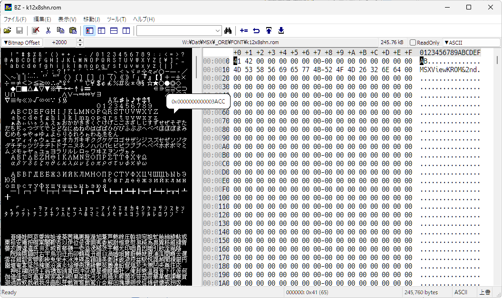
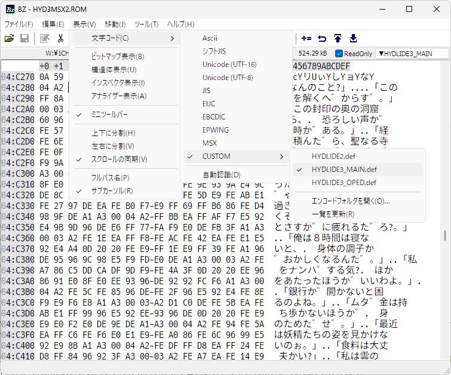
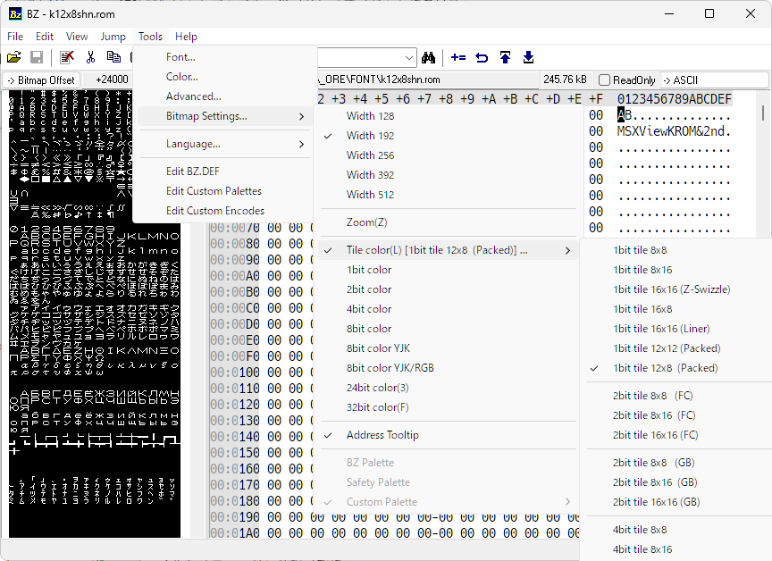
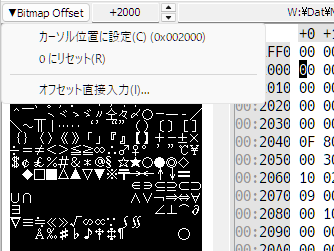

#  Binary Editor Bz - MSX Custom

Binary Editor Bz - MSX Users Custom Version 1.9.9.8b

[c.mosさん](http://www.vcraft.jp/)作、[Binary Editor Bz](http://www.vcraft.jp/soft/bz.html)の[tamachanさんの改造版](https://gitlab.com/devill.tamachan/binaryeditorbz)をベースに、MSXユーザー向けの機能を追加した物です。

Windows版のみの提供です。

構造体表示機能や分割画面と比較、メモリのビットマップ表示機能があります。

Binary Editor Bz for MSX は、MSX向けビットマップビュー拡張改造版です。

  - インストーラ―版 [BzEditor-1.9.9.8b-for-msx.exe](https://github.com/uniskie/MSX_MISC_TOOLS/blob/main/BinaryEditorBz_for_MSX/BzEditor-1.9.9.8b-for-msx.exe)
  - ポータブル版 [Bz1998bPortable-for-MSX.zip](https://github.com/uniskie/MSX_MISC_TOOLS/blob/main/BinaryEditorBz_for_MSX/Bz1998bPortable-for-MSX.zip)
  - 改変版ソースコードリポジトリ   
    https://gitlab.com/uniskie/binaryeditorbz-for-msx

- **追加機能以外の使い方/ オリジナルヘルプ**  
  https://devil-tamachan.github.io/BZDoc/



## 文字コード（テキストエンコード）

右側の文字表示エリアは**文字コード**が選べます。

本カスタム版ではMSX ANK文字とユーザー定義エンコードを追加しています。

文字列検索時は表示中のエンコードに従ってバイナリに変換し検索します。

| タイプ     | 解説                                   |
| ---------- | -------------------------------------- |
| ASCII      | ASCIIコードで表示します。              |
| SJIS       | シフトJISコードで表示します。          |
| UTF-16     | Unicode (UTF-16)で表示します。         |
| JIS        | JISコードで表示します。                |
| EUC        | EUCコードで表示します。                |
| UTF8       | Unicode (UTF-8)で表示します。          |
| EBCDIC     | EBCDICコードで表示します。             |
| EPWING     | EPWING(電子ブック)コードで表示します。 |
| **MSX**    | MSX ANKコードで表示します。            |
| **CUSTOM** | ユーザー定義エンコードで表示します。   |

## MSXエンコード用フォント

テキストエンコードが **MSX** の時、**MSXFontForDump**、**MSX-FONT**、または **MSX-FONT-Wide** で表示されます。

### MSX風フォントファイル

- **FontForDump.ttf**は、インストーラで当ソフトと一緒にインストールされます。  
    
  
  - ポータブル版の場合は同梱されている**Fonts/FontForDump.ttf** と **Fonts/FontForDumpN.ttf** を手動でインストールしてください。
- **MSX-FONT**は**MSXFontForDump**が存在しない場合に使用されます。
- **MSXFontForDump**も**MSX-FONT**もいずれもインストールされていなければ設定で指定したフォント（半角全角混じり）を使用します。
- 他のエンコードでは設定で指定したフォントになります。
- **MSX-FONT.ttf**はbugfireさんの [**DumpListEditor**](https://bugfire2009.ojaru.jp/download.html)
に同梱されています。

## CUSTOM：ユーザー定義エンコード

独自のマルチバイトエンコード形式を定義して使用できます。

 `*.def` ファイルを作成し、`%APPDATA%\BzEditor\CustomEncodes`  (ポータブル版は`CustomEncodes`) に配置してください。

メニューの「表示」 → 「文字コード」 → 「CUSTOM」 または、ミニツールバーの一番右にあるボタンから選べるようになります。


#### def ファイル 書式

```
; コメント
先頭キャラクタコード(16進数) (TABコード) 文字列
...
先頭キャラクタコード(16進数) (TABコード) 文字列


[マルチバイトの最初のキャラクタコード(16進数)]
先頭キャラクタコード(16進数) (TABコード) 文字列
先頭キャラクタコード(16進数) (TABコード) 文字列
...
先頭キャラクタコード(16進数) (TABコード) 文字列
```

#### CUSTOMエンコード定義サンプル

`%APPDATA%\BzEditor\CustomEncodes` (ポータブル版は`CustomEncodes`) には、サンプルファイルもインストールされています。

##### 例） HYDLIDE3_MAIN.def



## ビットマップ表示の追加機能

ビットマップビューにMSX向けの機能を追加拡張しました。  
他に、ビットマップビュー周りのバグを修正しています。

- ビットマップビューは**表示**→**ビットマップ表示** で表示切替

- ビットマップビュー設定は**ツール**→**ビットマップ設定** または、**ビットマップビュー上で右クリック**



### MSX向けビットマップ表示の概要

- 1bit color 8x8 ... SCREEN 0,1,2,4 / SPRITE 8x8 / ANK FONT
- 1bit color 8x16  ... SPRITE 16x16
- 1bit color 16x8  ... ハイドライドⅢ MSX2版 FONT
- 1bit color 16x16(Z-Swizzle)  ... 漢字ロム
- 1bit color 12x12  ... MSX-Viewフォント
- 1bit color 12x8  ... MSX-Viewフォント
- 2bit color ... SCREEN 6,9
- 4bit color ... SCREEN 5,7
- 8bit color YJK ... SCREEN 10,11
- 8bit color YJK/RGB ... SCREEN 12
- width 128 / 192 / 256 / 384 / 512
- MSX16 (パレット)
- MSX256 (パレット)
- MSX_logo (パレット)

各種コンシューマゲーム機（FC/GB/MD/PCE/SFC/GBA等）のキャラクタパターン・スプライト形式にも対応しています。

- 2bit Plane (FC) / Interleave (GB)
- 4bit 通常・縦優先 (MD) / Reverse bit order (GBA) / Plane / Interleave (SMS/GG) / Interleave Plane (SFC/PCE)
- 8bit 通常・縦優先 (GBA/SFC Mode 7等) / Interleave Plane (SFC)

### ビットマップ表示：MSX向け指定例

ビットマップ表示： 表示(V)→ビットマップ表示(B)

（Address Tooltipは意外と邪魔な時があるので、イラっとしたらOFFにすると良いです）

| カラー形式 | カラーパレット | 表示幅 | 表示用途 |
|---|---|---|---|
| tile/1bit color 8x8               | ---      | width 256 | SCREEN 0/1/2/4、8x8 SPRITE、FONT 8x8キャラ |
| tile/1bit color 8x16              | ---      | width 256 | 16x16 SPRITE |
| tile/1bit color 16x16 (Z-Swizzle) | ---      | width 256 | 漢字ROM |
| tile/1bit color 12x12 (Packed)    | ---      | width 192 | MSX-Viewフォント |
| tile/1bit color 12x8  (Packed)    | ---      | width 192 | MSX-Viewフォント |
| tile/1bit color 16x8              | ---      | width 256 | ハイドライド3 MSX2版 全角フォント |
| 2bit color                        | MSX_logo | width 512 | SCREEN 6/9、MSX起動ロゴ等 |
| 4bit color                        | MSX16    | width 256 | SCREEN 5 |
| 4bit color                        | MSX16    | width 512 | SCREEN 7 |
| 8bit color                        | MSX256   | width 256 | SCREEN 8 |
| 8bit color YJK/RGB                | MSX16    | width 256 | SCREEN 10/11 |
| 8bit color YJK                    | ---      | width 256 | SCREEN 12 |

### コンシューマ機向けタイルパターン（Tiled Pattern）

メニューの「ツール(T)」→「ビットマップ設定(B)」→「Tiled Pattern(L)」から選択します。  
ハードウェア固有の名称ではなく、データ構造に即した汎用的な形式名で定義されています。

| カラー形式 | カラーパレット | 変換処理 | 表示用途 |
|---|---|---|---|
| tile/2bit color 8x8   (Plane)           | GB_GRAY/GB_GREEN/GRAY4等 | 8x8 pixel (1bpp 8byte) x2プレーン | ファミコン BG/スプライト |
| tile/2bit color 8x16  (Plane)           | GB_GRAY/GB_GREEN/GRAY4等 | 8x16 pixel (1bpp 16byte) x2プレーン | ファミコン 8x16スプライト |
| tile/2bit color 16x16 (Plane)           | GB_GRAY/GB_GREEN/GRAY4等 | 16x16 pixel (8x8 4タイル) x2プレーン | ファミコン 16x16タイル |
| tile/2bit color 8x8   (Interleave)      | GB_GRAY/GB_GREEN/GRAY4等 | 1行2バイト インターリーブ (1 line = 8bit x2) | ゲームボーイ BG/スプライト |
| tile/2bit color 8x16  (Interleave)      | GB_GRAY/GB_GREEN/GRAY4等 | 1行2バイト インターリーブ (縦2タイル) | ゲームボーイ 8x16スプライト |
| tile/2bit color 16x16 (Interleave)      | GB_GRAY/GB_GREEN/GRAY4等 | 1行2バイト インターリーブ (2x2タイル) | ゲームボーイ 16x16タイル |
| tile/4bit color 8x8                     | MSX16/MIO/GRAY16等       | 4bpp 8x8 タイル (通常) | メガドライブ BG/スプライト等 |
| tile/4bit color 8x16                    | MSX16/MIO/GRAY16等       | 4bpp 8x16 (縦2タイル連続) | メガドライブ 8x16 / 16x16スプライト等 |
| tile/4bit color 8x24                    | MSX16/MIO/GRAY16等       | 4bpp 8x24 (縦3タイル連続) | メガドライブ 24x24スプライト等 |
| tile/4bit color 8x32                    | MSX16/MIO/GRAY16等       | 4bpp 8x32 (縦4タイル連続) | メガドライブ 32x32スプライト等 |
| tile/4bit color 16x16 (Z-Swizzle)       | MSX16/MIO/GRAY16等       | 4bpp 16x16 (8x8 Z順4タイル) | 16x16タイル (Z順) |
| tile/4bit color 8x8   (Reverse bit order) | MSX16/MIO/GRAY16等     | 4bpp 8x8 タイル (ビット逆順) | ゲームボーイアドバンス BG/OBJ等 |
| tile/4bit color 8x16  (Reverse bit order) | MSX16/MIO/GRAY16等     | 4bpp 8x16 (ビット逆順/縦2タイル) | ゲームボーイアドバンス 8x16スプライト等 |
| tile/4bit color 16x16 (Reverse bit order) | MSX16/MIO/GRAY16等     | 4bpp 16x16 (ビット逆順/Z順) | ゲームボーイアドバンス 16x16スプライト等 |
| tile/4bit color 8x8   (Plane)           | MSX16/MIO/GRAY16等       | 8x8 pixel (1bpp 8byte) x4プレーン | 4プレーン形式 |
| tile/4bit color 8x16  (Plane)           | MSX16/MIO/GRAY16等       | 8x16 pixel (1bpp 16byte) x4プレーン | 4プレーン形式 (縦2) |
| tile/4bit color 16x16 (Plane)           | MSX16/MIO/GRAY16等       | 16x16 pixel (16line x2byte) x4プレーン | 4プレーン形式 (16x16) |
| tile/4bit color 8x8   (Interleave)      | MSX16/MIO/GRAY16等       | 1行4バイト インターリーブ (4プレーン) | セガ・マスターシステム／ゲームギア BG/スプライト等 |
| tile/4bit color 8x16  (Interleave)      | MSX16/MIO/GRAY16等       | 1行4バイト インターリーブ (縦2タイル) | セガ・マスターシステム等 8x16スプライト |
| tile/4bit color 16x16 (Interleave)      | MSX16/MIO/GRAY16等       | 1行4バイト インターリーブ (2x2タイル) | 4プレーン インターリーブ 16x16 |
| tile/4bit color 8x8   (Interleave Plane)| MSX16/MIO/GRAY16等       | 1行2バイト インターリーブ x 2プレーン | スーパーファミコン／PCエンジン BG |
| tile/4bit color 8x16  (Interleave Plane)| MSX16/MIO/GRAY16等       | 1行2バイト インターリーブ x 2プレーン (縦2) | スーパーファミコン スプライト |
| tile/4bit color 16x16 (Interleave Plane)| MSX16/MIO/GRAY16等       | 1行2バイト インターリーブ x 2プレーン (Z順) | スーパーファミコン／PCエンジン スプライト |
| tile/8bit color 8x8                     | MSX256/GRAY256等         | 8bpp 8x8 タイル (通常) | ゲームボーイアドバンス 8bpp、SFC Mode 7等 |
| tile/8bit color 8x16                    | MSX256/GRAY256等         | 8bpp 8x16 (縦2タイル連続) | 8bit 縦2タイル連続スプライト |
| tile/8bit color 8x24                    | MSX256/GRAY256等         | 8bpp 8x24 (縦3タイル連続) | 8bit 縦3タイル連続スプライト |
| tile/8bit color 8x32                    | MSX256/GRAY256等         | 8bpp 8x32 (縦4タイル連続) | 8bit 縦4タイル連続スプライト |
| tile/8bit color 16x16 (Z-Swizzle)       | MSX256/GRAY256等         | 8bpp 16x16 (8x8 Z順4タイル) | ゲームボーイアドバンス 8bpp 16x16スプライト等 |
| tile/8bit color 8x8   (Interleave Plane)| MSX256/GRAY256等         | 1行2バイト インターリーブ x 4プレーン | スーパーファミコン 8bit BG/スプライト |
| tile/8bit color 8x16  (Interleave Plane)| MSX256/GRAY256等         | 1行2バイト インターリーブ x 4プレーン (縦2) | スーパーファミコン 8bit スプライト |
| tile/8bit color 16x16 (Interleave Plane)| MSX256/GRAY256等         | 1行2バイト インターリーブ x 4プレーン (Z順) | スーパーファミコン 8bit 16x16タイル |

※メガドライブ等のスプライトは縦優先（Column-major）でタイルが格納されるため、高さに合わせて `8x16` (2タイル高: 16x16等)、`8x24` (3タイル高: 24x24等)、`8x32` (4タイル高: 32x32等) を選択することで横に正しく連結表示されます。

### ビットマップ表示の表示更新について

バイナリデータの編集時、ビットマップビューがリアルタイムで更新されるようにしました。
重い場合はビットマップビューを閉じて編集してください。

### ビットマップ表示のアドレスオフセットについて

**Bitmap Offset**ボタンやその横にあるスピンボタンで、ビットマップとして表示するアドレスのオフセットが可能です。



**Bitmap Offset**ボタンを押すとポップアップメニューから
- 現在のカーソル位置で設定
- リセット
- 直接数値入力
を選択できます。

### パレットの編集

メニューの「ツール(T)」→「カスタムパレットの編集」  
で開くフォルダーにあるテキストファイル が、カラーパレット定義ファイルです。

（置いてあるファイル名がBITMAPビューの右クリックメニューから選べます。）

MSX向けに`MSX16.txt`、`MSX256.txt`、`MSX_logo.txt`を用意しましたが、
各自お好きな定義ファイルを追加してください。

[追加パレットのみのセット](https://github.com/uniskie/MSX_MISC_TOOLS/blob/main/BinaryEditorBz_for_MSX/BZPalettes-for-MSX.zip)

## 謝辞

元ソースコードはご厚意によって公開されている物です。  

[オリジナル版Readme](ReadMe_org.md)

Binary Editor BZ - original version -  
[Binary Editor BZ 1.6.2 Win](http://www.vcraft.jp/soft/bz.html) (New BSD License) --- Copyright (c) 1996-2004 [c.mos](https://www.vcraft.jp/index.html)

Binary Editor BZ - 改造版 -  
[Binary Editor BZ 1.9.8 Win](https://gitlab.com/devill.tamachan/binaryeditorbz/) (New BSD License) --- modify 1996-2004, 2012-2022 [tamachan](https://devil-tamachan.github.io/BZDoc/)

### ライセンス

当ソフトも継承元に準じて New BSD License で提供されます。

## 変更履歴

- 2026/09/29 version 1.9.9.8b
  - (バグ修正)画面復帰時にマルチビュー間で一時的なキャッシュの取り合いが発生してBZView が描画を途中で放棄して画面がブランクになる現象を修正
  - (高速化)CUSTOMエンコード定義およびカスタムパレットのキャッシュ機構を実装し、ビュー切替・フォント変更・検索時などの不要なファイル読み込みと再パースを抑止

- 2026/09/28 version 1.9.9.8a
  - (追加)ビットマップビューにメガドライブ等の縦優先スプライト向けタイル形式（8x24、8x32）を追加
  - (追加)ビットマップビューにGBA等のビット逆順タイル（4bit Reverse bit order 8x8、8x16、16x16）を追加
  - (追加)ビットマップビューに4プレーン形式（4bit Plane 8x8、8x16、16x16）を追加
  - (追加)ビットマップビューにセガ・マスターシステム／ゲームギア等の行インターリーブ形式（4bit Interleave 8x8、8x16、16x16）を追加
  - (追加)ビットマップビューにGBA 8bppやSFC Mode 7等に対応する8bit通常タイル形式（8x8、8x16、8x24、8x32、16x16）を追加
  - (改善)タイルパターンのメニュー表記・ID体系を機種名依存からデータ構造に即した汎用形式名（Plane、Interleave、Reverse bit order等）に再整理
  - (改善)ポータブルモード（EnablePortableMode.txt）でのタイル形式（BmpTileType）・カラー設定・カスタムエンコードの保持・復元に対応
  - (改善)ポップアップメニューおよびボタンメニューのステータスバーヘルプ表示に対応

- 2026/09/26 version 1.9.9.7
  - (追加)ビットマップビューの設定をメニュー：ツールからアクセスできるようにした
  - (変更)Contens(ヘルプ)をReadMe.htmlに変更
  - (追加)MSX ANK文字専用フォントの追加
  - (追加)ビットマップビューで開始オフセット指定機能追加
  - (追加)ビットマップビューで12x12、12x8のMSX Viewフォント対応を追加
  - (追加)CUSTOMキャラセット（エンコード）のファイル置き場を`%AppData%\BzEditor\CustomEncodes`に変更し、フォルダに格納されたファイルをメニューから選択可能に
  - (調整)ダンプビューのスクロールバーの移動量修正
  - (調整)ビットマップビューでのマウスホイール移動量を8pxまたは文字サイズ基準に変更
  - (調整)ビットマップビューでアドレスツールチップが邪魔にならない位置に移動
  - (調整)カスタムパレットをサブメニュー化
  - (調整)CUSTOMキャラセット（エンコード）をサブメニュー化
  - (調整)一部の長いコードをhファイルからcppファイルに移動
  - (バグ修正)クリップボードコピー処理修正（ダンプリストコピー、バイナリコピー、文字列コピーが機能しなくなっていた）
  - (バグ修正)クリップボード貼り付け処理修正（上書き時に追加になっていたり選択解除がされてなかったりした）
  - (バグ修正)テキストビュー幅の決定前に表示バッファを確保していたことによるメモリリークの修正

- 2026/09/13 version 1.9.9.6
  - CUSTOMキャラセットを追加  
    CUSTOM.defで独自のマルチバイトエンコードを定義可能  
  - フォント実測による文字表示処理と文字クリック処理に全面改修
  - 描画処理のちらつき対策でダブルバッファ化
  - サブカレットのバグ修正

- 2026/09/09 version 1.9.9.4
  - テキストビューのエンコードに「MSX」（MSXのANK文字）を追加
  - 内部をUNICODEベースに変更
  - ソースコードのエンコードをUTF-8に変更（SJISではトランプ記号等が書けないので）
  - ビットマップビューに 1bpp 16x8 (ハイドライド3 MSX2版 漢字フォント用)を追加

- 2025/05/27 version 1.9.9.1 
  - ビットマップビューにSFC用8bitタイル形式追加
  - カラータイプのタイル形式をサブメニューに移動
  - 4bit SFCタイル形式はPCEと共通なので文言変更
  - パレット定義ファイル名変更・追加
    - GRAY_GB → GB_GRAY
    - GREEN_GB → GB_GREEN
    - GRAY_2bit → GRAY4
    - GRAY_4bit → GRAY16
    - 新規追加 → GRAY256
    - 新規追加 → MIO

- 2025/05/25  
  - ビットマップビューにFC/GB/SFC/MD向け表示追加
  - カラーパレットフォルダ名をPalletsからPalettesに変更
  - ビットマップビューリアルタイム更新に変更  
    重い場合はビットマップビューを閉じて編集してください

- 2025/05/20  
  - ビットマップビューに 2bit color を追加  
  - カラーパレットに MSX_logoを追加  

- 2025/05/19  
  元からあったビットマップビューのバグを一通り修正  
  - アドレス←→スクロール位置変換式が相互に機能するように書き直し
  - データの取得でキャッシュヒットチェックが正常に機能していないのを修正
  - 元データが表示必要サイズに足りない場合に空きを足す処理を追加
  - モード切替での位置引継ぎとドキュメント読み込み時のリセットの使い分け

- 2025/05/18  
  MSX向け改造版公開  
  - 1bit color 8x8 （フォントやキャラ用）
  - 2bit color
  - 8bit coolor YJK
  - 8bit coolor YJK/RGB
  - width 512
  - パレットにMSX16、MSX256を追加
