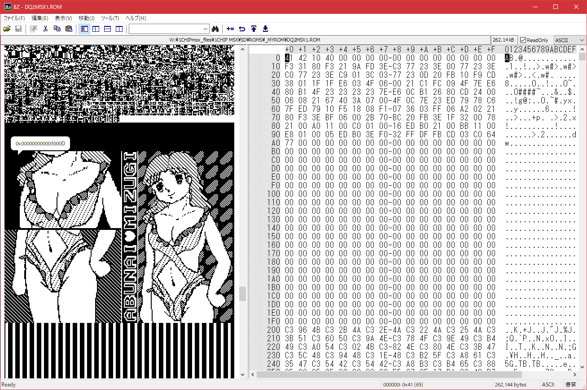
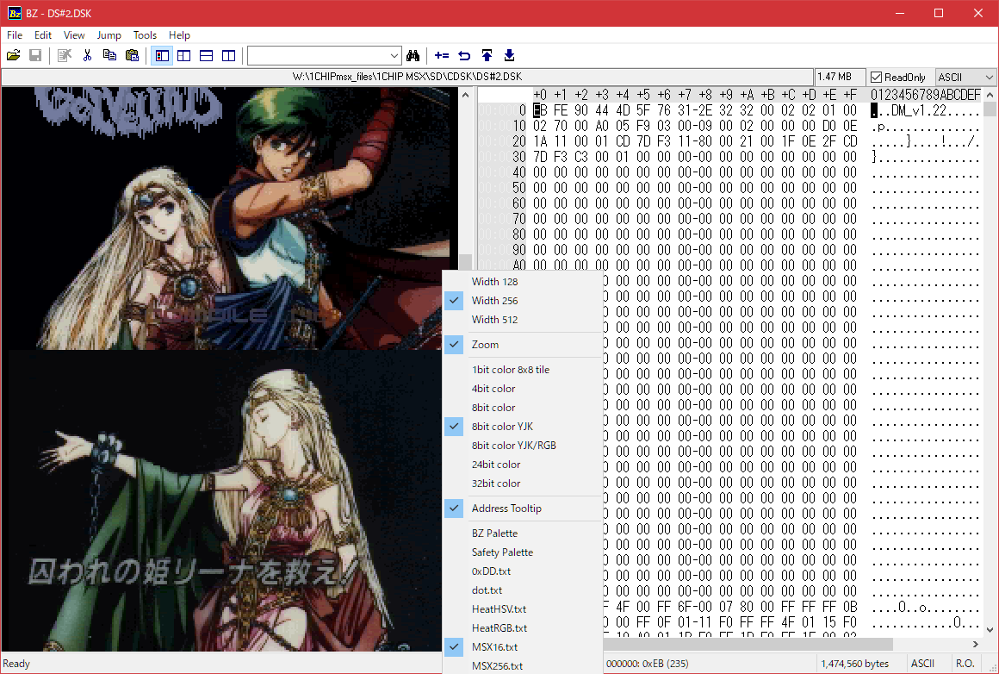
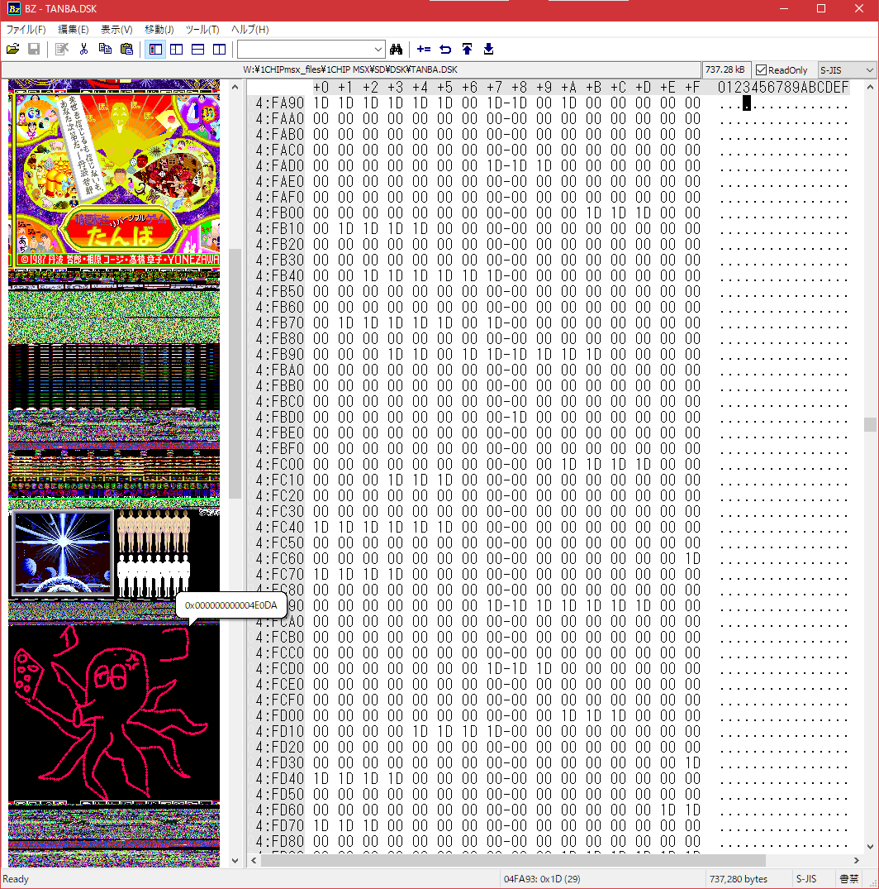

# Bitmap Palette for Bz Editor 
 
**Bz Editor**はバイナリエディタです  
  https://devil-tamachan.github.io/BZDoc/ 
 
構造体表示機能や分割画面と比較、
メモリのビットマップ表示機能があります。 

## MSX向けビットマップビュー拡張版

ビットマップビューを追加拡張しています。

- 1bit color 8x8 （フォントやキャラ用）
- 1bit color
- 8bit coolor YJK
- 8bit coolor YJK/RGB
- width 512

1bit color 8x8 モードではカーソル位置とアドレスの関係もそれっぽくしています。  
8bit coolor YJK/RGB モードではパレットも指定してください。  

- インストーラ―版 [BzEditor-1.9.8.7-for-msx.exe](BzEditor-1.9.8.7-for-msx.exe)
- ポータブル版 [Bz1987Portable-for-MSX.zip](Bz1987Portable-for-MSX.zip)
- 改変版ソースコードリポジトリ [https://gitlab.com/uniskie/binaryeditorbz-for-msx](https://gitlab.com/uniskie/binaryeditorbz-for-msx)

- 1bit color 8x8 tile  
  

- 8bit color YJK  
  

## MSXパレット定義を作りました

8ビット256ピクセル表示だと丁度SCREEN8になります。

ディスクイメージをこれで手軽にのぞいてみるのも
面白いかもしれません。 

## 使い方

Bz Editorのメニューの  
ツール→カスタムパレットの編集  
で開くフォルダーに、
MSX16.txt と MSX256.txt を入れて再起動してみてください。 

パレット定義まとめセット[BZPallets-for-MSX.zip](BZPallets-for-MSX.zip)

