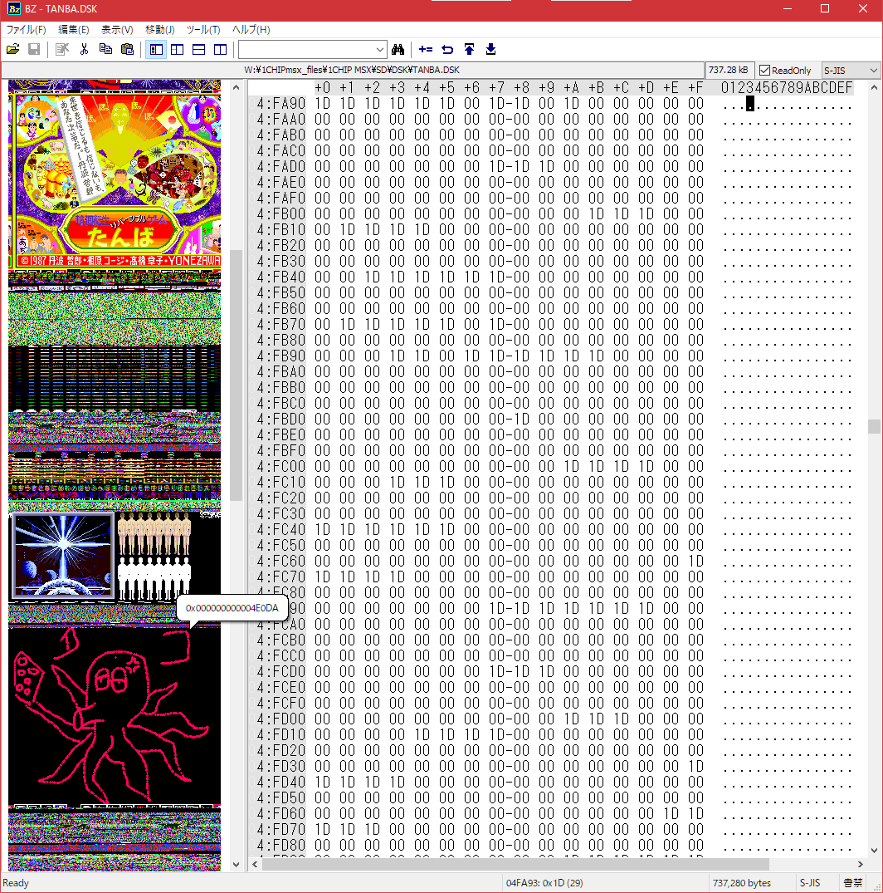

Bitmap Palette for Bz Editor 
 
--Bz Editorはバイナリエディタです。 
https://devil-tamachan.github.io/BZDoc/ 
 
構造体表示機能や分割画面と比較、
メモリのビットマップ表示機能があります。 

残念ながら4bitカラーには対応していませんが、
8ビット256ピクセル表示だと丁度SCREEN8になります。 
ディスクイメージをこれで手軽にのぞいてみるのも
面白いかもしれません。 
MSXパレット定義を作りました。 

Bz Editorのメニューの 
ツール→カスタムパレットの編集 
で開くフォルダーに入れて再起動してみてください。 

