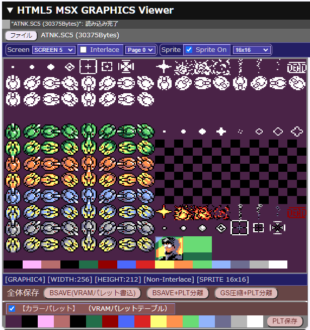
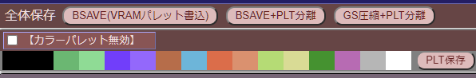
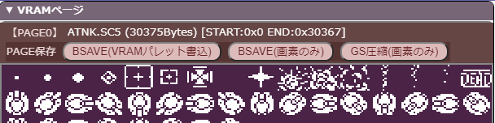
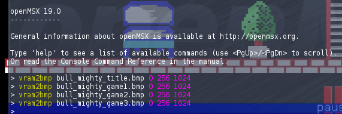
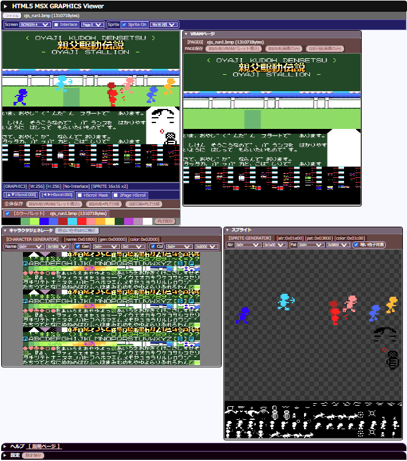
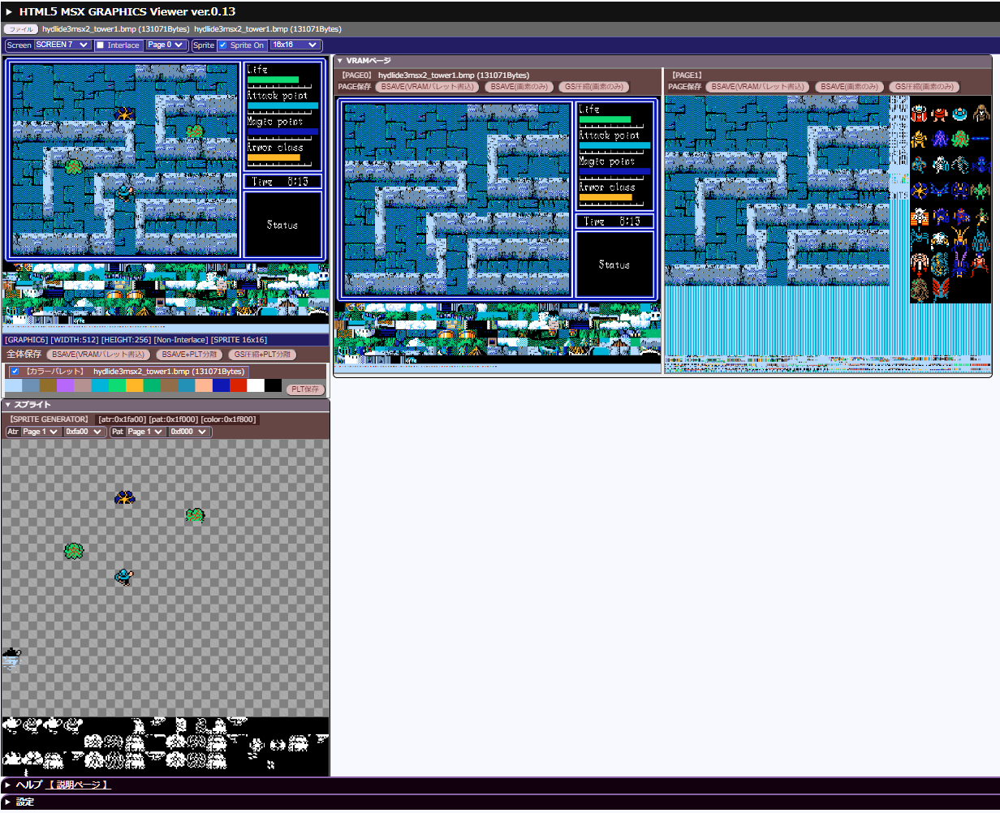
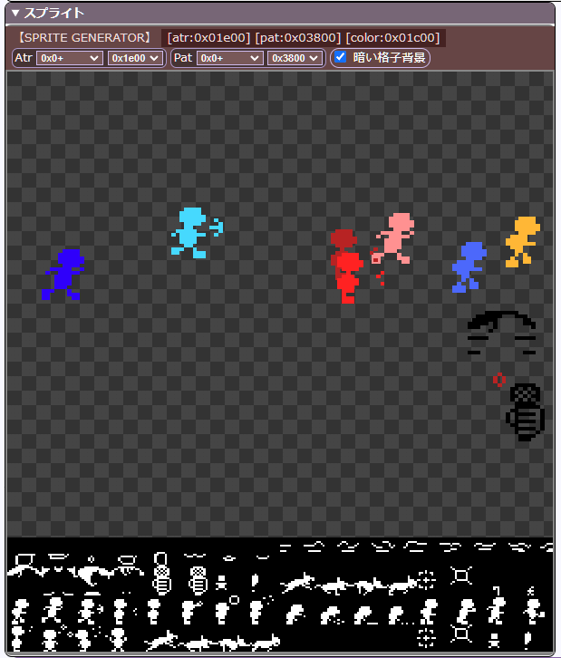

# HTML5 MSX GRAPHICS Viewer

 ブラウザ版 MSX画像ビューア

グラサウルス画像対応の、SCREEN0～SCREEN12の画像を表示・変換保存可能なツールです。

- [ブラウザから直接実行（ローカル）](gsrle.html)
- [ブラウザから直接実行（GithubPages）](https://uniskie.github.io/MSX_MISC_TOOLS/GSRLE/gsrle.html)
- [ローカル実行用ファイル一式 （HTML_MSX_GRAPHICS_Viewer_023.7z）](https://github.com/uniskie/MSX_MISC_TOOLS/raw/main/GSRLE/html/archive/HTML_MSX_GRAPHICS_Viewer_023.7z)
- [ソースコード（ファイル一式）](https://github.com/uniskie/MSX_MISC_TOOLS/tree/main/GSRLE/html)  

ローカル実行用ファイル一式をダウンロード・展開して使用することをお勧めします。

----

## 概要



- SCREEN 0～SCREEN 12のMSX画像ファイルに対応
- BSAVE形式、グラフサウルス圧縮形式の読み書き表示
- インターレース画像対応（SCREEN5以上）
- openMSXコンソールから```vram2bmp ファイル名.bmp 0 256 1024```で保存したBMPに対応
- スプライト(モード1&2)に対応

メインターゲットはスクリーン5～12のMSX画像です。

HTML5+javascript ES6の勉強+遊びの為に作成しているので、いつの間にか遊び機能が増えていくかもしれません。


## 使い方

ファイルをウィンドウにドロップするか  
ファイルボタンを使用してファイルを開いてください。

インターレースモード用画像かどうかは拡張子で判定されます。  
（[拡張子一覧](#%E5%AF%BE%E5%BF%9C%E6%8B%A1%E5%BC%B5%E5%AD%90)）

メイン画像ファイルと判定されると、読み込み済みファイルリストと画面をクリアしてから読み込みます。

その為、複数ファイルで構成された画像の場合は順番に開く必要があります。

順番は

1. メイン画像ファイル
2. インターレースモードなら2枚目のページの画像ファイル
3. パレットファイル

です。

この順番でドロップするか、まとめてドロップしてください。

まとめてドロップした場合は自動的に読み込む順番を整えて読み込みます。  
この時、1～3の分類それぞれにつき、各1個だけ読み込みます。

また、ファイルボタンから開くことも可能です。  
（その場合も複数ファイル指定可能です）

----

## MSX実機でのロード(グラフサウルス圧縮形式)

ローダーのサンプルがあります。

[https://github.com/uniskie/MSX_MISC_TOOLS/tree/main/LOADSRD](https://github.com/uniskie/MSX_MISC_TOOLS/tree/main/LOADSRD)

ビューアー・ローダーともに、
ソースコードの再利用はご自由にどうぞ。

画像ファイルの再利用はご遠慮ください。

----

## MSX画像の圧縮・展開 保存機能

読み込み済みファイルがあれば保存・圧縮保存が可能です。

また、表示されている画像を右クリックすると、ブラウザの機能を使ってPNGなどの画像として保存できます。

### 全体保存 / PLT保存 / ページ保存





| ボタン名 | 説明 | 補足 |
|---|---|---|
| PLT保存 | カラーパレットデータを保存します | グラフサウルスと違い、スロット1本分の32バイトのファイルです。 |
| BSAVE (VRAMパレット書込) | VRAMのカラーパレットテーブルを含む範囲でBSAVEベタ形式保存 | VRAMパレットテーブルに現在のパレットを書き込みます。</br>保存サイズがVRAMパレットテーブルより小さければ、テーブルを含む領域まで保存します。|
| BSAVE (画素のみ) | カラーパレットを含まない BSAVEベタ形式保存 | VRAMパレットテーブルにパレットを書き込みません。</br>VRAMパレットテーブルを考慮せず、ピクセルデータの範囲までを保存します。|
| GS圧縮 (画素のみ) | カラーパレットを含まない グラフサウルス圧縮形式保存 | VRAMパレットテーブルにパレットを書き込みません。</br>VRAMパレットテーブルを考慮せず、ピクセルデータの範囲までを保存します。|
| PLT保存 | カラーパレットデータを保存します | グラフサウルスと違い、スロット1本分の32バイトのファイルです。 |

- 画像保存ボタンは全体保存とページ毎保存があります。
- 設定に読み込み後自動保存機能があります
- ファイルを何も読み込んでいないと保存ボタンは動作しません。

----

## 設定保存・読み込み


各種設定を保存、読み込み出来ます。

保存時には ```gsrle_html_config.json``` というJSONファイルが保存されます。  
任意の名前.jsonに変更して保管しておくと、必要なときに素早く設定を変更できます。

読み込み時はJSONファイルを開くかドロップしてください。

保存・読み込みされる設定内容：

- スクリーンモード番号、インターレースモード、表示ページ
- スプライト表モード（8x8、16x16、2倍表示、スプライト表示/非表示）
- キャラクタジェネレータ・ベースアドレス
- スプライト・ベースアドレス
- 画面縦サイズ設定、DotAspect比、読み込み後自動保存設定
- カラーパレットVRAM読み込み設定、TMS9918風カラー設定

### 注：BSAVE保存時のファイルヘッダについて

BLOADで読み込むときに、サイズ&hFFFFを越えるファイルは読みだしたデータが化けます。

> 例)  
> ```START=0, END=FFFF``` を越えるファイル  
> ファイル全体では```&h10007```バイト以上
>
> - VRAM全体セーブ
> - SCREEN7,8,10,12での1ページ丸ごと保存

そのため、BSAVEファイルヘッダのENDエントリはサイズが&hFFFFを越えない値を書き出します。
ファイル自体は最後まで書き込まれまます。

> 例)
>
> - VRAM全体セーブ
>
>   ```START=0, END=FFFE``` → ```START=0, END=FFFE```  
>   実際にファイルに書きだされるVRAMの範囲は```&h0000～&hFFFF```  
>   ファイル全体のサイズは```&h10007```バイト
>
> - SCREEN7,8,10,12での1ページ丸ごと保存
>
>   ```START=0, END=FFFE``` → ```START=0, END=FFFE```  
>   実際にファイルに書きだされるVRAMの範囲は```&h0000～&hFFFF```  
>   ファイル全体のサイズは```&h10007```バイト

この対策によりデータは化けなくなりますが  
BLOADでは&h0000～&hFFFEまでしか読み込めません。

全体を読みだしたいときは独自のローダーを使用し、  
ファイルサイズを見て読みだすようにすれば、  
データの最後まで読み込むことが出来ます。

( [https://github.com/uniskie/MSX_MISC_TOOLS/tree/main/LOADSRD](https://github.com/uniskie/MSX_MISC_TOOLS/tree/main/LOADSRD) など)

----

## openMSX vram2bmp出力ファイルの表示

openMSXでは```vram2bmp```でVRAM全体のRAWファイルに相当するBMPファイルを出力できます。

1. openMSXでF10キーを押してコンソールを表示
2. コンソールで ```vram2bmp ファイル名.bmp 0 256 1024```でVRAM全体保存
   

> **Note**: 保存先について
>
> カレントフォルダは
> 基本的にOpenMSXを起動した実行ファイルと同じ場所になっています。
>
> 1. OpenMSX Catapultから実行した場合は ```OpenMSX\Catapult\bin```
> 2. openmsx.exeを直接実行した場合は ```OpenMSX\```
> ```cd```（チェンジディレクトリ）コマンドでカレントディレクトリを変えておくとファイルが整理しやすくて良いかもしれません。
>
> **Note**: 保存先の変更例
>
> 1. ```マイドキュメント\openMSX\``` に ```bmp``` フォルダを作成
> 2. コンソールから ```cd $env(OPENMSX_USER_DATA)/bmp```
>
> → マイドキュメント\openMSX\bmp\ に保存されるようになる
>
>> openMSX起動時に自動的に実行されるスクリプトに  
>> ```cd $env(OPENMSX_USER_DATA)``` を書いておけば良いかもしれません。  
>> （自分はユーザーフォルダに自動実行スクリプトを配置する方法が分からないのでやっていません）

```vram2bmp```で保存されるのはRAWイメージなので普通のBMPとして表示すると実際の画面に表示されている映像とは異なる見た目になります。

当ビューアではそのVRAM RAWイメージを読み込んで、MSX上での見え方で表示することが可能です。  
（画面モードや、ベースアドレスは自分で指定してください）

自分向け遊び機能ですが、内容確認などの使い道はあるかもしれません。

### 表示例





HYDLIDE3 (C) T&E SOFT / D4 Enterprise

----

## スプライト・キャラジェネの表示ベースアドレス指定

- スクリーン0～4ではキャラクタジェネレータ欄が表示されます。  
  

- スクリーン1～12ではスプライト欄が表示されます。  
  

### 各ベースアドレス

VDPで設定可能な値がドロップダウンリストに登録されていますので、そこから選択可能です。

- PATNAM (キャラクターパターンネームテーブル)
- PATGEN (キャラクターパターンジェネレータテーブル)
- PATCOL (キャラクターパターンカラーテーブル)
- SPRATR (スプライトアトリビュートテーブル)
- SPRPAT (スプライトパターンテーブル)

※ SPRCOL (スプライトカラーテーブル) は```SPRATR (スプライトアトリビュートテーブル) - 512```にVDPが自動決定します。

----

## 設定：読み込み後自動保存

画像の読み込みが終わった後に指定の形式で自動保存するオプション


| 形式 | 内容 | パレットデータ |
|---|---|---|
| BSAVE(VRAMパレット書込) | BSAVE形式（VRAMカラーパレットテーブルを含む）画像ファイル | BSAVEファイルに含む ||
| BSAVE+PLT分離 | BSAVE形式（VRAMカラーパレットテーブルを含まない）画像ファイルと、PLTファイルのセット | PLTファイル |
| GS圧縮+PLT分離 | グラフサウルス圧縮形式画像ファイルと、PLTファイルのセット | PLTファイル |

----

## おまけ：縦スクロール／横スクロール

VDPシミュレートの検証で付けている処理です。


1. **▲▼VScroll**  
   縦スクロールスイッチ  
   - 上下にドラッグで縦スクロール
   - クリックでリセット

   スプライトごと移動する

2. **◀▶HScroll**  
   横スクロールスイッチ  
   - 上下にドラッグで縦スクロール
   - クリックでリセット

   スプライトは影響をうけない

3. **HScroll Mask**  
   画面左に8ドット幅の周辺色マスクを表示する
   スプライトもマスクされる

4. **2Page HScroll**  
   VDP R#25 bit0：2画面横スクロール  
   表示ページは奇数を指定する

   1ページのVRAMサイズ
   - SCREEN0～6,9は```0x8000```
   - SCREEN7,8,10～12は```0x10000```

## 補足：インターレース＆フリップモード

インターレースモードで2ページをフリップさせて疑似的に424ライン表示する機能


```Interlace```にチェックを付けるとインターレース＆フリップモードになります。  
市販ソフトではDPSSGがSCREEN7で使用して、VGAに近い解像度を実現していました。

※ SCREEN0～4では使用できません

※ ```2Page HScroll```と同様に強制的に表示ページを奇数ページに変更します。

----

## 対応拡張子

拡張子で判定して、インターレースモードでの読込先ページを決定します。

1. パレットの有無、画面サイズ、圧縮などはデータの内容を見て判定します。
2. SC1はSSCREEN12のインターレース画像として扱います。
3. SCREEN1画像の場合、SC1の代わりにSR1を使用してみてください。
4. SCREEN 9は未テストです。
5. 保存時は現在表示している縦サイズで保存します。

| 拡張子 | SCREEN番号 | インターレースモード | BSAVE拡張子 | GS拡張子 | 補足 |
|---|---|---|---|---|---|
| .SC2 | SCREEN  2 | non-interlace    | .SC2 |.SR2 | BSAVE
| .SC3 | SCREEN  3 | non-interlace    | .SC3 |.SR4 | BSAVE
| .SC4 | SCREEN  4 | non-interlace    | .SC4 |.SR3 | BSAVE
| .SC5 | SCREEN  5 | non-interlace    | .SC5 |.SR5 | BSAVE
| .SC6 | SCREEN  6 | non-interlace    | .SC6 |.SR6 | BSAVE
| .SC7 | SCREEN  7 | non-interlace    | .SC7 |.SR7 | BSAVE
| .SC8 | SCREEN  8 | non-interlace    | .SC8 |.SR8 | BSAVE
| .S10 | SCREEN 10 | non-interlace    | .S10 |.SRA | BSAVE
| .S12 | SCREEN 12 | non-interlace    | .S12 |.SRC | BSAVE
| .S50 | SCREEN  5 | interlace page:0 | .S50 |.R50 | BSAVE interlace
| .S51 | SCREEN  5 | interlace page:1 | .S51 |.R51 | BSAVE interlace
| .S60 | SCREEN  6 | interlace page:0 | .S60 |.R60 | BSAVE interlace
| .S61 | SCREEN  6 | interlace page:1 | .S61 |.R61 | BSAVE interlace
| .S70 | SCREEN  7 | interlace page:0 | .S70 |.R70 | BSAVE interlace
| .S71 | SCREEN  7 | interlace page:1 | .S71 |.R71 | BSAVE interlace
| .S80 | SCREEN  8 | interlace page:0 | .S80 |.R80 | BSAVE interlace
| .S81 | SCREEN  8 | interlace page:1 | .S81 |.R81 | BSAVE interlace
| .SA0 | SCREEN 10 | interlace page:0 | .SA0 |.RA0 | BSAVE interlace
| .SA1 | SCREEN 10 | interlace page:1 | .SA1 |.RA1 | BSAVE interlace
| .SC0 | SCREEN 12 | interlace page:0 | .SC0 |.RC0 | BSAVE interlace
| .SC1 | SCREEN 12 | interlace page:1 | .SC1 |.RC1 | BSAVE interlace
| .SR2 | SCREEN  2 | non-interlace    | .SC2 |.SR2 | GRAPH SAURUS
| .SR4 | SCREEN  3 | non-interlace    | .SC3 |.SR4 | GRAPH SAURUS
| .SR3 | SCREEN  4 | non-interlace    | .SC4 |.SR3 | GRAPH SAURUS
| .SR5 | SCREEN  5 | non-interlace    | .SC5 |.SR5 | GRAPH SAURUS
| .SR6 | SCREEN  6 | non-interlace    | .SC6 |.SR6 | GRAPH SAURUS
| .SR7 | SCREEN  7 | non-interlace    | .SC7 |.SR7 | GRAPH SAURUS
| .SR8 | SCREEN  8 | non-interlace    | .SC8 |.SR8 | GRAPH SAURUS
| .SRA | SCREEN 10 | non-interlace    | .S10 |.SRA | GRAPH SAURUS
| .SRC | SCREEN 12 | non-interlace    | .S12 |.SRC | GRAPH SAURUS
| .SRS | SCREEN 12 | non-interlace    | .S12 |.SRS | GRAPH SAURUS
| .R50 | SCREEN  5 | interlace page:0 | .S50 |.R50 | GRAPH SAURUS interlace
| .R51 | SCREEN  5 | interlace page:1 | .S51 |.R51 | GRAPH SAURUS interlace
| .R60 | SCREEN  6 | interlace page:0 | .S60 |.R60 | GRAPH SAURUS interlace
| .R61 | SCREEN  6 | interlace page:1 | .S61 |.R61 | GRAPH SAURUS interlace
| .R70 | SCREEN  7 | interlace page:0 | .S70 |.R70 | GRAPH SAURUS interlace
| .R71 | SCREEN  7 | interlace page:1 | .S71 |.R71 | GRAPH SAURUS interlace
| .R80 | SCREEN  8 | interlace page:0 | .S80 |.R80 | GRAPH SAURUS interlace
| .R81 | SCREEN  8 | interlace page:1 | .S81 |.R81 | GRAPH SAURUS interlace
| .RA0 | SCREEN 10 | interlace page:0 | .SA0 |.RA0 | GRAPH SAURUS interlace
| .RA1 | SCREEN 10 | interlace page:1 | .SA1 |.RA1 | GRAPH SAURUS interlace
| .RC0 | SCREEN 12 | interlace page:0 | .SC0 |.RC0 | GRAPH SAURUS interlace
| .RC1 | SCREEN 12 | interlace page:1 | .SC1 |.RC1 | GRAPH SAURUS interlace

### 暫定対応：スクリーン0～1

| 拡張子 | SCREEN番号 | インターレースモード | BSAVE拡張子 | GS拡張子 | 補足 |
|---|---|---|---|---|---|
| .TX1 | SCREEN 0 WIDTH 40 | non-interlace    | .TX1 |.TX1 | BSAVE / GS
| .TX2 | SCREEN 0 WIDTH 80 | non-interlace    | .TX2 |.TX2 | BSAVE / GS
| .GR1 | SCREEN 1          | non-interlace    | .GR1 |.GR1 | BSAVE / GS
| .SR0 | SCREEN 0 WIDTH 40 | non-interlace    | .SR0 |.SR0 | BSAVE / GS
| .SR1 | SCREEN 1          | non-interlace    | .SR1 |.SR1 | BSAVE / GS

### 特殊

| 拡張子 | SCREEN番号 & インターレースモード | BSAVE拡張子 | GS拡張子 | 補足 |
|---|------|---|---|---|
| .BIN'  | 現在の画面モード | .BIN | .BIN | 汎用
| .SPR'  | 現在の画面モード | .SPR | .SPR | スプライト
| .SPC'  | 現在の画面モード | .SPC | .SPC | スプライトカラー
| .NAM'  | 現在の画面モード | .NAM | .NAM | SC2 パターンネーム
| .COL'  | 現在の画面モード | .COL | .COL | SC2 パターンカラー
| .GEN'  | 現在の画面モード | .GEN | .GEN | SC2 パターンジェネレータ
| .PAT'  | 現在の画面モード | .PAT | .PAT | SC2 パターンジェネレータ
| .NM'   | 現在の画面モード | .NM' | .NM' | SC2 パターンネーム
| .CL'   | 現在の画面モード | .CL' | .CL' | SC2 パターンカラー
| .GN'   | 現在の画面モード | .GN' | .GN' | SC2 パターンジェネレータ
| .CL0'  | 現在の画面モード | .CL0 | .CL0 | SC2 パターンカラー
| .CL1'  | 現在の画面モード | .CL1 | .CL1 | SC2 パターンカラー
| .CL2'  | 現在の画面モード | .CL2 | .CL2 | SC2 パターンカラー
| .GN0'  | 現在の画面モード | .GN0 | .GN0 | SC2 パターンジェネレータ
| .GN1'  | 現在の画面モード | .GN1 | .GN1 | SC2 パターンジェネレータ
| .GN2'  | 現在の画面モード | .GN2 | .GN2 | SC2 パターンジェネレータ
| .SCR'  | 現在の画面モード | .SCR | .GSR | RAWイメージ
| .GSR'  | 現在の画面モード | .SCR | .GSR | RAWイメージ
| .BMP'  | 現在の画面モード | .SCR | .GSR | RAWイメージ - OpenMSX vram2bmp の非圧縮BMP
| .VRM'  | 現在の画面モード | .VRM | .GSR | RAWイメージ - 新10倍で読み込み変換したもの等

----

## PNGやBMPからMSX用画像への変換について

本ツールにはMSX画像形式からの圧縮や展開のみをサポートしています。  
PNGなどからの変換機能が欲しい場合は他のツールを使用してください。

(※vram2bmpで保存したbmpはVRAMのRAWイメージなので特別にそのまま表示可能です。)

- BMP to MSX  
  自分が良く使用しているのは、hra1129さんの変換ツール  BMP to MSX です。  
  [https://github.com/hra1129/bmp2msx](https://github.com/hra1129/bmp2msx)

- その他ツール紹介ページ  
  [Gigamax Online Webアプリ多め！ネットで見つけたMSX向け画像編集ツールまとめ](https://gigamix.hatenablog.com/entry/devmsx/graphics-tools#MSX-Screen-Converter%E3%82%AA%E3%83%B3%E3%83%A9%E3%82%A4%E3%83%B3-MSX%E5%90%91%E3%81%91%E5%90%84%E7%A8%AE%E7%94%BB%E5%83%8F%E3%82%B3%E3%83%B3%E3%83%90%E3%83%BC%E3%82%BF)

----

## 使用許諾

### 禁止事項

音楽データや画像ファイルの再利用はご遠慮ください。（全体的に）

### 再利用可能なもの

画像ファイル以外のHTML、CSS、JSファイルはご自由に利用してください。
改変なども可能です。

### 引責事項

転載や改変についてサポートは致しかねます。  
また、このツールの使用による問題が起きた場合に、当方は責任を負わないものとします。

----

## 更新履歴

- 2023/09/15 [ver.0.23](https://github.com/uniskie/MSX_MISC_TOOLS/raw/main/GSRLE/html/archive/HTML_MSX_GRAPHICS_Viewer_023.7z)
  - スプライトベースアドレス選択のページリストがおかしくなっていたのを修正
  - SCREEN7,8,10,11,12で実機同様にVRAMへのインターリーブ接続を有効にする。（画面モード切替時の表示が実機と同じになる）

- 2023/09/15 [ver.0.22](https://github.com/uniskie/MSX_MISC_TOOLS/raw/main/GSRLE/html/archive/HTML_MSX_GRAPHICS_Viewer_022.7z)
  - スプライト処理最適化に伴う拡大表示のバグ修正
  - スクロール対応描画処理最適化に伴うインターレース表示時の横256ドット時のバグ修正
  - 横スクロールの処理追加
  - 表示更新処理を最適化
  - インターレースモード画像表示時に違う画面モードのインターレース画像を表示した際に表示ページが0になるバグの修正  
    （※ インタレース＆フリップでの424ライン表示の場合はVDP表示ページを奇数にする必要がある）

- 2023/09/13 [ver.0.21](https://github.com/uniskie/MSX_MISC_TOOLS/raw/main/GSRLE/html/archive/HTML_MSX_GRAPHICS_Viewer_021.7z)
  - スプライトモード2の時の表示制限判定を修正
  - スプライトモード2の時の表示制限で半透明処理をする際に不透明ピクセルの透明度を上書きしないように修正
  - メインキャンバスをドラッグでスクロールする機能を追加
  - BSAVEヘッダのサイズ制限について説明追加

- 2023/09/11 [ver.0.20](https://github.com/uniskie/MSX_MISC_TOOLS/raw/main/GSRLE/html/archive/HTML_MSX_GRAPHICS_Viewer_020.7z)
  - スプライト横並び制限設定に網掛追加
  - アーカイブ置き場変更

- 2023/09/11 [ver.0.19](https://github.com/uniskie/MSX_MISC_TOOLS/raw/main/GSRLE/html/archive/HTML_MSX_GRAPHICS_Viewer_019.7z)
  - 設定読み書きにVRAMパレットテーブル読み込み抑制スイッチ追加
  - パレット無効化スイッチを画面下にも追加

- 2023/09/10 ver.0.18
  - 設定読み込み時、"画面縦サイズ"、"DotAspect比"のラジオボタン選択状態が反映されないのを修正

- 2023/09/09 ver.0.17
  - スプライト横並び制限設定に半透明追加

- 2023/09/09 ver.0.16
  - スプライト横並び制限が常に無効になっていたのを修正
  - スプライト横並び制限の無効化スイッチ追加

- 2023/09/09 ver.0.15
  - 設定の保存と読み込みを追加  
    設定保存ボタンでgsrle_html_config.jsonが保存されます  
    *.jsonを開く、またはドロップで設定が反映されます

- 2023/09/09 ver.0.14
  - BMP・GSR・SCRのRAWファイル読み込み時のファイル名表示修正

- 2023/09/09 ver.0.13
  - 表示ページ指定を追加
  - スプライトの**縦位置が1ドット上**だったのを修正
  - スプライトモード２のCCビット処理を修正  
    - 3枚以上での重ね合わせを修正
    - 同一ラインにCC=0のスプライトが表示しない場合でも表示していたのを修正
  - スプライトのTPビットの処理が常に有効だったのを修正  
     （TPビット:カラー０を指定したときに透明にならずにカラーパレットの色で表示する）
  - スクリーン0,1,2,3でカラーパレットのチェックを外して無効にした際、TMS9918A風の色にする設定を追加

- 2023/09/08 ver.0.12
  - 仮に HTML5 MSX GRAPHICS Viewer ver.0.12 とした。
  - 画面モードの変更や各種画面設定を変更できるようにUIや処理追加。
  - スプライトモード1と2に対応。表示サイズモードやスプライト非表示スイッチも追加。
  - openMSXで ```VRAM2bmp filename.bmp 0 256 1024``` として保存したBMPに対応
    （画面モードやベースアドレスは自分で指定）
  - SCREEN0～12まで正式対応。
  - SCREEN0 WIDTH80でのブリンクは非対応
  - スプライトモード2のTRビット（透明色ではなくカラー0で描画）には非対応
  - 細かいUIデザイン変更。

- 2023/09/05
  - SCREEN2～4の画像保存が正常動作しないのを修正。
  - こっそりSCREEN0と1に対応。
  - こっそりGEN、COL、NAM、PATなどのVRAM部分セーブファイルに対応。
    - 扱いはSCREEN2画像
    - 部分ファイルはメインファイル名として記録されないのでメイン画像がないと保存出来ない。  
      （※TEST.SC2などのSCREEN2全体画像を読み込んだ後に部分データを読み込むとセーブ可能）

- それ以前
  - 何か色々修正
