# MSX Dump Editor

MSXバイナリ向けのエディターです。  
自分が欲しい機能を付けました。

PythonとtkInterによるGUIプログラミングの学習・復習用に作ったものなのであまり期待しないでください。

一応WSL2経由のUbuntuで動作ができるように調整はしました。
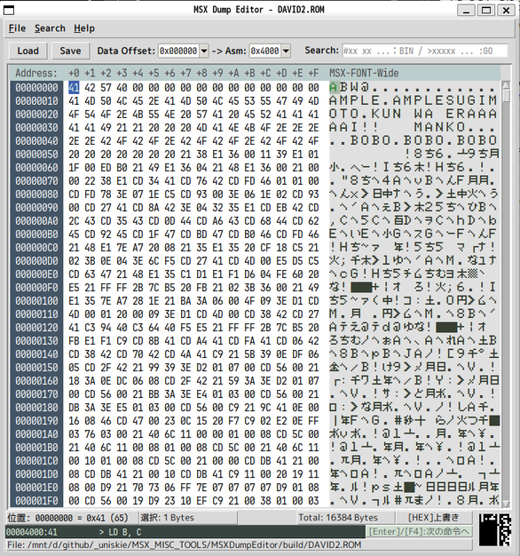

このドキュメントは実装メモのような物です。

---

## フォントについて

日本語フォントが無いと結構酷いことになります。  
OSの差を吸収するため、現在はVL ゴシックとUDEV Gothicの使用を前提に、調整しています。

確認しているのは、Windows11がメインで、サブでWSL2+Ubuntuです。

### フォントの入手

- UDEV Gothic：https://github.com/yuru7/udev-gothic
- VL ゴシック：https://github.com/daisukesuzuki/VLGothic
- HackGen：https://github.com/yuru7/HackGen
- BIZ UDゴシック：https://fonts.google.com/specimen/BIZ+UDGothic

### MSX-FONT

- MSX-FONT、MSX-FONT-Wide  
  bugfireさんのDumpListEditorに同梱されている、
  "MSX-FONT.tff"や"MSX-FONT-Wide.tff"がOSにインストールされていれば、
  文字表示欄がMSXフォントで表示されます。  
  https://bugfire2009.ojaru.jp/download.html

### フォントの優先順

`font_helper.py` で定義

- HEXエディタ：`jp_programming_fonts`
- UIフォント：`jp_sans_ui_fonts`
- デフォルトフォント：`jp_mono_fonts`

---

## 起動方法

- Windowsであれば`MSXDumpEditor.exe`を実行

- Python3がインストールされている環境なら  
  `py MSXDumpEditor.py`  
  または
  `python3 MSXDumpEditor.py`  
  
  で実行可能

- 起動時に引数を与えるか、`MSXDumpEditor.exe`にファイルをドロップして起動すると、起動時に指定されたファイルを開く
  
### 表示機能

- **HEX表示**  

  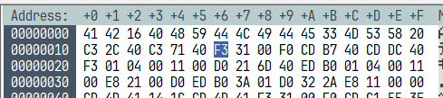  

  - 1行は16バイト単位
  - 編集可能

- **アスキー文字表示**  

  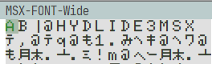  

  - MSX-FONTがインストールされていればそれを使用
  - 編集可能（かなや記号は全角文字で代替入力）

- **スプライトプレビュー**  
  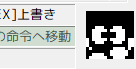  
  - カーソル位置から32バイトを16x16スプライトとして表示

- **1ライン逆アセンブラ**

  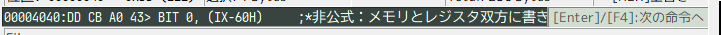  

  - ステータスバーにカーソル位置の逆アセンブル表示（1命令分）  
  - `Data Offset`コンボボックスで指定したバイナリオフセットアドレスに対して、`Asm`コンボボックスで指定したMSXアドレスを対応
  - ワンキーで**次の命令へ**移動

- **逆アセンブラ ビュー ウィンドウ**  

    

  - 選択範囲を逆アセンブル
  - ビューウィンドウを開いて表示
  - 構文色分けあり
  - 表示されたTextを全選択してコピー可能
  - ラベルジャンプ可能

※ テスト用のダミーデータありで起動しますが、困らないと思うのでそのままにしてます。

---

## ファイル操作

- **バイナリセーブ・ロード**  
  - `Ctrl + O`でファイル読み込みダイアログを開く
  - `Ctrl + S`でファイル保存ダイアログを開く

    - 保存ダイアログなしの上書き保存は未実装
    - 書き換え禁止機能も未実装  

---

## 編集機能

### **16進数（HEX）入力モード**  

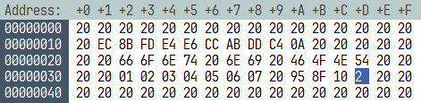  

- `0`～`9`、`A`～`F`を入力すると値書き換え
- 2桁入力で自動確定して次のアドレスへ移動
- 2文字入力する前にカーソルを動かしたりHEXエディット以外に遷移すると1桁で確定  

### **文字（ASCII）入力モード**

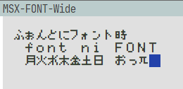  

- ASCII文字(アスキーコード32～126)以外は、全角の代替文字で入力可能
- コントロールコードやHEX入力で入力すること (7F,90,A0,FE,FF)

### **16進数入力モード**と**文字入力モード**の切り替え  

- `F2`キー で交互に切り替え
- `TAB`/`Shift+Tab`で前後にフォーカス移動
- 該当エリアをクリック

### **入力モード共通操作**  

- `DEL`：**カーソル位置**の1バイトを**削除**
- `BS`：**カーソル位置手前**の1バイトを**削除**
- `HOME`/`END`：**行頭/行末へ移動**  
  - `Ctrl`を押しながら：**データ先頭/データ末尾へ移動**
- `PageUp`、`PageDown`：**ページ単位移動**  
 - `Ctrl`を押しながら：動作未定義
- `Ctrl+A`：**全選択**
- `Ins`：**上書き**/**挿入**の**切替**
  -   

- コピー&ペースト
  - `Ctrl + C`：**選択範囲をクリップボードへコピー**
  - `Ctrl + V`：**クリップボードからペースト**
  ※ クリップボードはスペース区切りの16進数文字列でやり取り  
  例) `41 42 DB 41`

- **UNDO**/**REDO**
  - `Ctrl + Z`：**UNDO**（**変更を取り消し**）
  - `Ctrl + Y`：**REDO**（**変更をやり直し**）
  - 深さはメモリが許す限り

- **範囲選択**
  - `Shift`キーを押しながらカーソル移動で選択範囲拡大

---

## **検索機能**

- **バイナリ検索**、**文字列検索**、**アドレスジャンプ**  

  - **検索ボックスの動作**  
    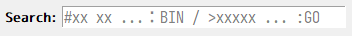  
   （Bzエディタに慣れた人向け）  

    - **バイナリ検索**： `#xx xx xx...`  
      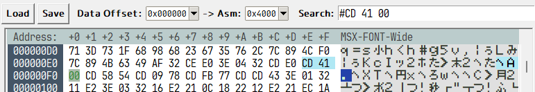  
      - 先頭が#で16進数(0～FF)  
      - スペース切りで複数バイト指定可能

    - **アドレスジャンプ**: `>xxxxxx`  
      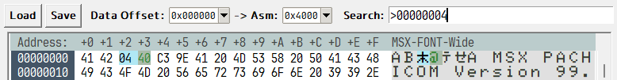  
      - 先頭が>の16進数文字列(0～FFFFFFFF)

    - **文字検索**： `上記以外` （※ 仕様変更の可能性アリ）  
      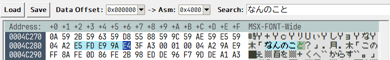  
      - 例）`>`や`#`に続く文字が16進数以外である場合など
      - 全角のひらがな・カタカナ、記号なども検索に使用可能  
        （内部的に全角からMSXキャラクタコード変換）

### 検索操作

- `Ctrl + F`：**検索ボックスへ移動**
  - 既に検索ボックスに入力があれば全選択
  - ジャンプ命令があればクリア
  - `#xx xx xx ...` ：バイナリ検索
  - `>xxxxx` ：アドレスジャンプ
  - それ以外： 文字検索
  
- **`Ctrl + F3`**：**現在選択中の値で検索**
  - 検索ボックスが空の状態で`F3`キーも同様の動作

- **`F3`**：**次を検索**
  - **検索ボックスの内容**で**検索**または**移動**
  - **検索ボックスが空**なら、現在選択中の値で検索  
    （`Ctrl+F3`と同じ挙動）

- **`Ctrl + G`**：**アドレスジャンプ**
  - 検索ボックスへ移動して`>`を入力した状態で待機  
    `>アドレス`  
    と入力して`Enter`/`F3`で移動実行  
    例) `>4000⏎`
  - ステータスバーに表示されている**1行逆アセンブラ**に**16進数リテラル**があればそれを自動入力
  - **2バイト選択**状態の時は、その値を16ビットアドレス値として自動入力  
  - ※ **アドレス自動入力**時はアドレス変換設定に従ったバイナリアドレスに変換する

- **`Alt + 左(←)キー`**：アドレスジャンプ履歴を**戻る**
- **`Alt + 右(→)キー`**：アドレスジャンプ履歴を**進む**

---

## [逆アセンブル用] **アドレス変換設定**  

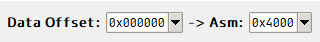  

**バイナリアドレス** → **MSXアドレスへ**の変換方法を指定する。

設定は`Data Offset`コンボボックスと`Asm`コンボボックスの組み合わせで行う。  

- 例） `Data Offset:0x000000` で `-> Asm: 0x4000` の時、  
  バイナリの先頭を逆アセンブラでは`4000H`として扱う

---

## **逆アセンブル ウィンドウ**  

  

- HEX編集画面で`Ctrl + Enter`を押すと**DisAssembleViewウィンドウ**に逆アセンブル結果を出力する
- **選択範囲**を逆アセンブルする
- **選択範囲**がなければ、現在のカーソル位置から0x1000バイトを対象にする
- **選択範囲**のサイズが**0x2000バイト**でも結構重いので、それより大きいときは警告あり
- 出力されるリストは、リスト範囲内にジャンプしている個所はラベル化
- シンボルリストには非対応
- 逆アセンブラは自前につき動作保証なし
- 未定義命令にも対応（未定義の場合は補足を付けて表示）  

### **DisAssembleViewウィンドウでの操作**

- "`G`"：**ラベルジャンプ**
  - カーソル位置に`Xxxxx`形式のジャンプラベルがあれば該当位置へジャンプ  
    （`CALL`/`JP`/`JR`/`DJNZ`や`(アドレス)`で、かつ、アセンブルリスト内にあるアドレスが対象）
- "`B`"：ジャンプ履歴：一つ**前の位置へ**移動
- "`F`"：ジャンプ履歴：一つ**次の位置へ**移動
- テキストビューなので範囲選択して`Ctrl+C`で**クリップボードにコピー可能**

---

## Python環境について

- Python3  
  pyファイルの実行をする場合に必要。  
  WindowsであればストアやVSインストーラからインストール可能。  

### 使用するPythonモジュール

- tkinterdnd2  
  ファイルのドラッグアンドドロップに対応するために必要。  
  インストールはコマンドコンソールから  
  `> pip install tkinterdnd2⏎`

- PyInstaller  
  pyファイルからexeファイルを作成したい場合に必要。
  インストールはコマンドコンソールから  
  `> pip install PyInstaller⏎`

---

### メモ

#### WSL:Ubuntuの場合

- linuxで *VL Gothic*をインストール  
  `sudo apt update && sudo apt install fonts-vlgothic -y`

- `pip` インストール  

  `sudo apt update && sudo apt install python3-pip -y`

- `tkinterdnd2` インストール

  `pip3 install pipreqs --break-system-packages`

- `import tkinter`でエラーが出る  

  ディストリビューションによってはtkが入ってないのでインストールする  
  `sudo apt update && sudo apt install python3-tk -y`

- 日本語文字が化ける  

  日本語フォントが入ってないのでインストールする
  `sudo apt update && sudo apt install fonts-noto-cjk -y`

- MSX-FONTを使いたい  
  
  - 自分のアカウントでのみ使う場合
  
    1. アカウント用のフォントフォルダ作成（なければ）  
       `mkdir -p ~/.local/share/fonts`
  
    2. アカウント用のフォントフォルダへコピー  
       `cp "/(DumpListEditor/Font/MSX)/MSX-FONT-Wide.tff" ~/.local/share/fonts/`  
       `cp "/(DumpListEditor/Font/MSX)/MSX/MSX-FONT.tff" ~/.local/share/fonts/`

       ※ `(DumpListEditor/Font/MSX)`は、各自がDumpListEditorをダウンロードして展開した場所に合わせて書き換える

    3. フォントキャッシュを更新  
       `fc-cache -fv`
  
  - システム共通で使う場合（管理者権限が必要）
  
    1. システム用のフォントディレクトリにファイルをコピーする  
       `sudo cp "/(各自にあわせる)/DumpListEditor/font/MSX/MSX-FONT.tff" /usr/local/share/fonts/`

    2. フォントキャッシュを更新  
       `sudo fc-cache -fv`

  - 確認方法
  
    `fc-list | grep -i "MSX"`

#### 寄り道

- `pipregs` インストール  

  `pip3 install pipreqs --break-system-packages`
  
- `pipregs`による足りないmoduleリストの作成  
  このフォルダにカレントパスを移動して  
  `pipreqs . --encoding=utf-8`
  
  これでエラーなら  
  `~/.local/bin/pipreqs . --encoding=utf-8`
  
  成功すれば `requirements.txt` が作成される

- `requirements.txt` を利用したモジュールのインストール  

  `pip3 install -r requirements.txt --break-system-packages`

---

## 最後に

練習確認用に適当に作ったものなので、改変はご自由に。

Python+tkInterでは
重い動作を回避するために
自前で仮想スクロールやら入力やら表示、
キー処理も自前でのカスタマイズが必要になりますね。
これはWIN32プログラミングと変わらない部分ですが
より重くなりやすい感じであるのと、
tkinterの内部動作や仕様の問題も多々。

（VSCode+python拡張機能で作業するなら）
プロパティでアクセスしやすいのは良い所。

Pythonって時々構文書式が気持ち悪いし
構文がややこしいのも遅さの要因になりそうですが
どうなんでしょうね。

tkinterでのGUIプログラミングですが、
OSによってtkInterの挙動やフォントの処理が違うので
色々諦めた妥協案にしています。

pythonに限らず、どの環境で作るにしても
デザインにおいてのフォントは大事なので
そのあたりも毎回悩まされます。
