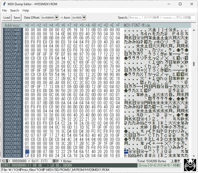
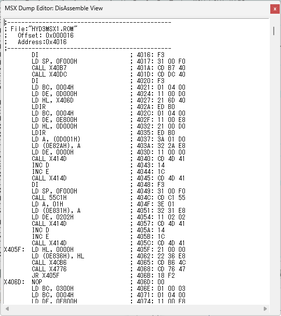

# MSX Dump List Editor

MSXバイナリ向けのエディターです。  
自分が欲しい機能を付けました。

PythonとtkInterによるGUIプログラミングの学習・復習用に作ったものなのであまり期待しないでください。

このドキュメントは実装メモのような物です。

## MSX-FONT について

- MSX-FONT、MSX-FONT-Wide  
  bugfireさんのDumpListEditorに同梱されている、
  "MSX-FONT.tff"や"MSX-FONT-Wide.tff"がOSにインストールされていれば、
  文字表示欄がMSXフォントで表示されます。  
  URL: https://bugfire2009.ojaru.jp/download.html

## 起動方法

- Windowsであれば`MSXDumpEditor.exe`を実行

- Python3がインストールされている環境なら  
  `> py MSXDumpEditor.py`  
  で実行可能
  
### 表示機能

- HEX表示

- 文字表示（MSX-FONTがインストールされていればそれを使用）

- スプライトプレビュー

- 1ライン逆アセンブラ
  カーソル位置から1命令逆アセンブル表示
  （データのオフセット指定とそれに対応するMSXアドレスの設定あり）

※ テスト用のダミーデータありで起動しますが、困らないと思うのでそのままにしてます。

### 操作

- 書き換え禁止機能は未実装
- 保存ダイアログなしの上書き保存は未実装

- バイナリセーブ・ロード
  - `Ctrl + O`でファイル読み込みダイアログを開く
  - `Ctrl + S`でファイル保存ダイアログを開く

- 逆アセンブルリスト出力
  - `Ctrl + Enter`で選択範囲を逆アセンブルして別ウィンドウに出力
  - 選択範囲がなければ、現在のカーソル位置から0x1000バイトを対象にする
  - 選択範囲のサイズが0x2000でも結構重いので、それより大きいときは警告あり
  - 出力されるリストは、リスト範囲内にジャンプしている個所はラベル化
  - シンボルリストには非対応
  - 逆アセンブラは自前なので動作保証しません
  - 未定義命令にも対応（未定義の場合は補足を付けて表示）  
  

- HEX値入力編集 （文字入力編集は無し）  
  - `0`～`9`、`A`～`F`を入力すると値書き換え
  - 2桁入力で自動確定して次のアドレスへ移動
  - 2文字入力する前にカーソルを動かしたりHEXエディット以外に遷移すると1桁で確定
  
  - `DEL`：カーソル位置の1バイトを削除
  - `BS`：前の1バイトを削除
  - `HOME`、`END`：行頭、行末、Ctrl押しながら出データ先頭と末尾へ移動
  - `PageUp`、`PageDown`：ページ単位移動 （Ctrlとの同時押しは未定義）
  - `Ctrl+A`：全選択

- 上書きモード、挿入モード
  - `Ins`キーで切り替え

- コピー&ペースト
  - `Ctrl + C`でコピー
  - `Ctrl + V`でペースト
  - クリップボードはスペース区切り2桁16進数文字列でやり取りする

- UNDO/REDO
  - `Ctrl + Z`でUNDO（取り消し）
  - `Ctrl + Y`でREDO（やり直し）
  - メモリが許す限り無限
  
- 複数選択
  - `Shift`キーを押しながらカーソル移動で選択範囲拡大

- バイナリ検索、文字列検索、アドレスジャンプ  
  （Bzエディタに慣れた人向け）  
  
  - `Ctrl + F`：検索ボックスへ移動
    既に検索ボックスに入力があれば全選択
    
  - `Ctrl + F3`：現在選択中の値で検索
    - （検索ボックスが空の状態で）`F3`キーでも同じ

  - `F3`：次を検索
    - 検索ボックスの内容で検索/移動する
    - 検索ボックスが空なら、現在選択中の値で検索（`Ctrl+F3`と同じ挙動）

  - `Ctrl + G`：アドレスジャンプ
    - 検索ボックスへ移動して`>`を入力した状態で待機
    - 1行逆アセンブラに16進数リテラルがあればそれを自動入力
    - 2バイト選択時は、その値を16ビットアドレス値として自動入力  
    
    ※ 自動入力時は逆アセンブラ向けアドレス変換設定に従ったアドレスに変換

  - `Alt + 左(←)キー`：アドレスジャンプ履歴を後ろに移動
  - `Alt + 右(→)キー`：アドレスジャンプ履歴を先に移動

### 検索ボックス

  - バイナリ検索：  
     `#xx xx xx...`  
     - 先頭が#で16進数(0～FF)  
     - スペース切りで複数バイト指定可能

  - アドレスジャンプ:
     `>xxxxxx`  
     - 先頭が>の16進数文字列(0～FFFFFFFF)

  - 文字検索：  
    - 上記以外 (例えば>や#に続く文字が16進数以外。など)  
    - 全角のひらがな・カタカナ、記号なども検索に使用可能  
      （内部的に全角からMSXキャラクタコード変換）

## Python環境

- Python3  
  pyファイルの実行をする場合に必要。  
  WindowsであればストアやVSインストーラからインストール可能。  

### 使用するPythonモジュール
- tkinterdnd2  
  ファイルのドラッグアンドドロップに対応するために必要。  
  インストールはコマンドコンソールから  
  `> pip install tkinterdnd2⏎`

- PyInstaller  
  pyファイルからexeファイルを作成したい場合に必要。
  インストールはコマンドコンソールから  
  `> pip install PyInstaller⏎`

## 今後

練習確認用に適当に作ったものなので、改変はご自由に。

Python+tkInterでは自前でスクロールやら入力やら表示などの
WIN32プログラミングと変わらない手順で、
データサイズが増えても速度が落ちない定番の工夫
（仮想スクロールなど）が必要なのも一緒ですね。

プロパティである程度用意されていて一括指定しやすいのは良い所。

それでもWIN95時代のCPU並みの速度に感じます。

Pythonって時々構文書式が気持ち悪いのはどうなんでしょうね。

