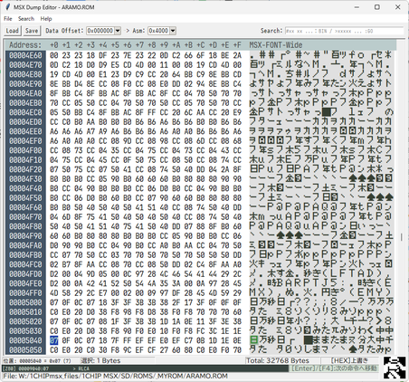
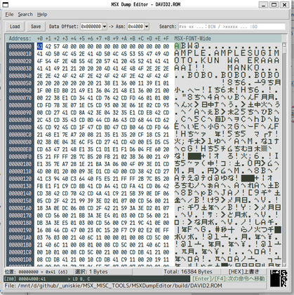

# MSX Dump Editor

MSXバイナリ向けのエディターです。  
自分が欲しい機能を付けました。

PythonとtkInterによるGUIプログラミングの学習・復習用に作ったものなのであまり期待しないでください。

一応WSL2経由のUbuntuで動作ができるように調整はしました。

このドキュメントは実装メモのような物です。

## フォントについて

日本語フォントが無いと結構酷いことになります。  
推奨フォントを優先して使用するようにしています。

### フォントの入手

- UDEV Gothic：https://github.com/yuru7/udev-gothic
- HackGen：https://github.com/yuru7/HackGen
- VLゴシック：https://github.com/daisukesuzuki/VLGothic
- BIZ UDゴシック：https://fonts.google.com/specimen/BIZ+UDGothic

### MSX-FONT

- MSX-FONT、MSX-FONT-Wide  
  bugfireさんのDumpListEditorに同梱されている、
  "MSX-FONT.tff"や"MSX-FONT-Wide.tff"がOSにインストールされていれば、
  文字表示欄がMSXフォントで表示されます。  
  https://bugfire2009.ojaru.jp/download.html

### フォントの優先順

font_helper.py で定義

- HEXエディタ：jp_programming_fonts
- UIフォント：jp_sans_ui_fonts
- デフォルトフォント：jp_mono_fonts

## 起動方法

- Windowsであれば`MSXDumpEditor.exe`を実行

- Python3がインストールされている環境なら  
  `py MSXDumpEditor.py`  
  または
  `python3 MSXDumpEditor.py`  
  
  で実行可能
  
### 表示機能

- HEX表示
  - 1行は16バイト単位

- アスキー文字表示
  - MSX-FONTがインストールされていればそれを使用

- スプライトプレビュー
  - カーソル位置から32バイトを16x16スプライトとして表示

- 1ライン逆アセンブラ
  - カーソル位置から1命令逆アセンブル表示  
    （データのオフセット指定とそれに対応するMSXアドレスの設定あり）
  - [ENTER]/[F4] で次の命令へ移動

- アセンブリコードビュー
  - 選択範囲の逆アセンブルの場合、ビューウィンドウを開いて表示
  - 構文色分けあり

※ テスト用のダミーデータありで起動しますが、困らないと思うのでそのままにしてます。

### 操作

- 書き換え禁止機能は未実装
- 保存ダイアログなしの上書き保存は未実装

- バイナリセーブ・ロード
  - `Ctrl + O`でファイル読み込みダイアログを開く
  - `Ctrl + S`でファイル保存ダイアログを開く

- 逆アセンブルリスト出力
  - `Ctrl + Enter`で選択範囲を逆アセンブルして別ウィンドウに出力
  - 選択範囲がなければ、現在のカーソル位置から0x1000バイトを対象にする
  - 選択範囲のサイズが0x2000でも結構重いので、それより大きいときは警告あり
  - 出力されるリストは、リスト範囲内にジャンプしている個所はラベル化
  - シンボルリストには非対応
  - 逆アセンブラは自前なので動作保証しません
  - 未定義命令にも対応（未定義の場合は補足を付けて表示）  
  

- HEX入力とアスキー文字入力モードの切り替え
  - `F2` で交互に切り替え
  - TAB/Shift+Tabで前後にフォーカス移動

- HEX値入力モード
  - `0`～`9`、`A`～`F`を入力すると値書き換え
  - 2桁入力で自動確定して次のアドレスへ移動
  - 2文字入力する前にカーソルを動かしたりHEXエディット以外に遷移すると1桁で確定

- アスキー文字入力モード
  - ASCII文字(アスキーコード32～126)以外にも全角の代替文字で入力可能
  - コントロールコードはHEX入力で入力して下さい

  - `DEL`：カーソル位置の1バイトを削除
  - `BS`：前の1バイトを削除
  - `HOME`、`END`：行頭、行末、Ctrl押しながら出データ先頭と末尾へ移動
  - `PageUp`、`PageDown`：ページ単位移動 （Ctrlとの同時押しは未定義）
  - `Ctrl+A`：全選択

- 上書きモード、挿入モード
  - `Ins`キーで切り替え

- コピー&ペースト
  - `Ctrl + C`でコピー
  - `Ctrl + V`でペースト
  - クリップボードはスペース区切り2桁16進数文字列でやり取りする

- UNDO/REDO
  - `Ctrl + Z`でUNDO（取り消し）
  - `Ctrl + Y`でREDO（やり直し）
  - メモリが許す限り無限
  
- 複数選択
  - `Shift`キーを押しながらカーソル移動で選択範囲拡大

- バイナリ検索、文字列検索、アドレスジャンプ  
  （Bzエディタに慣れた人向け）  
  
  - `Ctrl + F`：検索ボックスへ移動
    既に検索ボックスに入力があれば全選択
    
  - `Ctrl + F3`：現在選択中の値で検索
    - （検索ボックスが空の状態で）`F3`キーでも同じ

  - `F3`：次を検索
    - 検索ボックスの内容で検索/移動する
    - 検索ボックスが空なら、現在選択中の値で検索（`Ctrl+F3`と同じ挙動）

  - `Ctrl + G`：アドレスジャンプ
    - 検索ボックスへ移動して`>`を入力した状態で待機
    - 1行逆アセンブラに16進数リテラルがあればそれを自動入力
    - 2バイト選択時は、その値を16ビットアドレス値として自動入力  
    
    ※ 自動入力時は逆アセンブラ向けアドレス変換設定に従ったアドレスに変換

  - `Alt + 左(←)キー`：アドレスジャンプ履歴を後ろに移動
  - `Alt + 右(→)キー`：アドレスジャンプ履歴を先に移動

### 検索ボックス

  - バイナリ検索： `#xx xx xx...`  
     - 先頭が#で16進数(0～FF)  
     - スペース切りで複数バイト指定可能

  - アドレスジャンプ: `>xxxxxx`  
     - 先頭が>の16進数文字列(0～FFFFFFFF)

  - 文字検索：  
    - 上記以外 (例えば>や#に続く文字が16進数以外。など)  
    - 全角のひらがな・カタカナ、記号なども検索に使用可能  
      （内部的に全角からMSXキャラクタコード変換）

## Python環境

- Python3  
  pyファイルの実行をする場合に必要。  
  WindowsであればストアやVSインストーラからインストール可能。  

### 使用するPythonモジュール

- tkinterdnd2  
  ファイルのドラッグアンドドロップに対応するために必要。  
  インストールはコマンドコンソールから  
  `> pip install tkinterdnd2⏎`

- PyInstaller  
  pyファイルからexeファイルを作成したい場合に必要。
  インストールはコマンドコンソールから  
  `> pip install PyInstaller⏎`

### メモ

#### WSL:Ubuntuの場合

- linuxで *VL Gothic*をインストール  
  `sudo apt update && sudo apt install fonts-vlgothic -y`

- `pip` インストール  

  `sudo apt update && sudo apt install python3-pip -y`

- `tkinterdnd2` インストール

  `pip3 install pipreqs --break-system-packages`

- `import tkinter`でエラーが出る  

  ディストリビューションによってはtkが入ってないのでインストールする  
  `sudo apt update && sudo apt install python3-tk -y`

- 日本語文字が化ける  

  日本語フォントが入ってないのでインストールする
  `sudo apt update && sudo apt install fonts-noto-cjk -y`

- MSX-FONTを使いたい  
  
  - 自分のアカウントでのみ使う場合
  
    1. アカウント用のフォントフォルダ作成（なければ）  
       `mkdir -p ~/.local/share/fonts`
  
    2. アカウント用のフォントフォルダへコピー  
       `cp "/(DumpListEditor/Font/MSX)/MSX-FONT-Wide.tff" ~/.local/share/fonts/`  
       `cp "/(DumpListEditor/Font/MSX)/MSX/MSX-FONT.tff" ~/.local/share/fonts/`

       ※ `(DumpListEditor/Font/MSX)`は、各自がDumpListEditorをダウンロードして展開した場所に合わせて書き換える

    3. フォントキャッシュを更新  
       `fc-cache -fv`
  
  - システム共通で使う場合（管理者権限が必要）
  
    1. システム用のフォントディレクトリにファイルをコピーする  
       `sudo cp "/(各自にあわせる)/DumpListEditor/font/MSX/MSX-FONT.tff" /usr/local/share/fonts/`

    2. フォントキャッシュを更新  
       `sudo fc-cache -fv`

  - 確認方法
  
    `fc-list | grep -i "MSX"`

#### 寄り道

- `pipregs` インストール  

  `pip3 install pipreqs --break-system-packages`
  
- `pipregs`による足りないmoduleリストの作成  
  このフォルダにカレントパスを移動して  
  `pipreqs . --encoding=utf-8`
  
  これでエラーなら  
  `~/.local/bin/pipreqs . --encoding=utf-8`
  
  成功すれば `requirements.txt` が作成される

- `requirements.txt` を利用したモジュールのインストール  

  `pip3 install -r requirements.txt --break-system-packages`

## 最後に

練習確認用に適当に作ったものなので、改変はご自由に。

Python+tkInterでは
重い動作を回避するために
自前で仮想スクロールやら入力やら表示、
キー処理も自前でのカスタマイズが必要になりますね。
これはWIN32プログラミングと変わらない部分ですが
より重くなりやすい感じであるのと、
tkinterの内部動作や仕様の問題も多々。

（VSCode+python拡張機能で作業するなら）
プロパティでアクセスしやすいのは良い所。

Pythonって時々構文書式が気持ち悪いし
構文がややこしいのも遅さの要因になりそうですが
どうなんでしょうね。

tkinterでのGUIプログラミングですが、
OSによってtkInterの挙動やフォントの処理が違うので
色々諦めた妥協案にしています。

pythonに限らず、どの環境で作るにしても
デザインにおいてのフォントは大事なので
そのあたりも毎回悩まされます。

仕事の社内ツールを作る時ならフォントも含めたインストーラを作るのですが。
