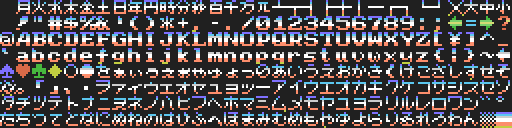
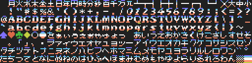
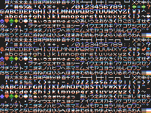

# Free MSX Fonts

Data for MSX -> [MSXFNT/](MSXFNT/)

## LOAD asmple

[MSXFNT/LOADFNT.BAS](MSXFNT/LOADFNT.BAS)   
```RUN"LOADFNT.BAS```

## sample images

- mini font  
   小さめの文字 ... SCREEN 0でも使える6x8フォント  
   グラフィック文字とかな以外の英数字は6x6に収めています。  
   Pattern data: [MSXFNT/MINIFONT.GEN](MSXFNT/MINIFONT.GEN)  
   ```BLOAD"MINIFONT.GEN",S```  
     

- font 1  
   デザイン文字1... 少し派手  
   Pattern data: [MSXFNT/FNT0.GEN](MSXFNT/FNT0.GEN)  
   ```BLOAD"FNT0.GEN",S```  
     
   (additional) Color data: [MSXFNT/FNT0.COL](MSXFNT/FNT0.COL)  
   ```BLOAD"FNT0.COL",S```  
   

- font 2  
   デザイン文字2 ... 少しテクノ  
   Pattern data: [MSXFNT/FNT1.GEN](MSXFNT/FNT1.GEN)  
   ```BLOAD"FNT1.GEN",S```  
     
   (additional) Color data: [MSXFNT/FNT1.COL](MSXFNT/FNT1.COL)  
   ```BLOAD"FNT1.COL",S```  
   

- font 3  
   デザイン文字3 ... 少し古文書風  
   Pattern data: [MSXFNT/FNT2.GEN](MSXFNT/FNT2.GEN)  
   ```BLOAD"FNT2.GEN",S```  
     
   (additional) Color data: [MSXFNT/FNT2.COL](MSXFNT/FNT2.COL)  
   ```BLOAD"FNT2.COL",S```  
   

SCREEN 0で使う場合は  
```BLOAD"MINIFONT.GEN",S,&H800```  
のように```,S```の後ろに```,&H800```を追加します。

## Other data

- [MSXFNT/FNT.SC2](MSXFNT/FNT.SC2)   
    ... SCREEN2 data converted from ```my_font_set_1c.png```  
      
    ( use [BMP2MSX](https://github.com/hra1129/bmp2msx) )

- [MSXFNT/SPLITFNT.BAS](MSXFNT/SPLITFNT.BAS)   
    ```RUN"SPLITFNT.BAS```   
    1.  BMP2MSXやpiroPAINT_9918ではキャラの背景色が必ずしもカラー0にはならないので、データを修正します。  
        Modify FontBit and correct character's background color.  
        (In BMP2MSX and piroPAINT_9918, ```bit = 0``` is not necessarily color 0)
    2.  SPLIT 3 FONTS from ```FNT.SC2```  
        -> make   
         ```FNT0.GEN```, ```FNT0.COL```   
         ```FNT1.GEN```, ```FNT1.COL```   
         ```FNT2.GEN```, ```FNT2.COL```

- [MSXFNT/GRP6X8.BAS](MSXFNT/GRP6X8.BAS)  
    ... GRAPHIC CHARACTER CONVERT to 6x8  
    月～小までのグラフィック文字を機械的に6x8ドットにして
    ```GRP6X8.GEN```に保存します。  
    一律の方法で縮小するのでそのままでは使えません。  
    MINIFONTでは出力されたGRP6X8フォントを元に見た目を修正しています。

- [MSCFNT/MINIMAKE.BAS](MSCFNT/MINIMAKE.BAS)  
    ... MINIFONT.GENをSC2画像として保存します。  
    MINIFONTはカラーデータが無いのでSC1で使用する目的の物ですが  
    一応デフォルトカラーテーブルを作成、テーブル0のパターンをテーブル1,2にコピーして保存します。

## LICENCE

These fonts is Free to use, modify and redistribute.
(Free Licence)

改変再配布ともにご自由にどうぞ。


