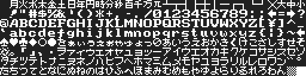
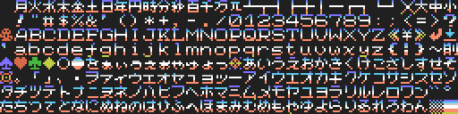

# Free MSX Fonts

Data for MSX -> [MSXFNT/](MSXFNT/)

## LOAD asmple

[MSXFNT/LOADFNT.BAS](MSXFNT/LOADFNT.BAS)   
```RUN"LOADFNT.BAS```

## sample images

- font 1  
   Pattern data ```BLOAD"FNT0.PAT",S```  
     
   (additional) Color data ```BLOAD"FNT0.COL",S```  
   
- font 2  
   Pattern data ```BLOAD"FNT1.PAT",S```  
     
   (additional) Color data ```BLOAD"FNT1.COL",S```  
   
- font 3  
   Pattern data ```BLOAD"FNT2.PAT",S```  
     
   (additional) Color data ```BLOAD"FNT2.COL",S```  
   

## Other data

- [MSXFNT/FNT.SC2](MSXFNT/FNT.SC2)   
    ... SCREEN2 data converted from ```my_font_set_1c.png```  
      
    ( use [BMP2MSX](https://github.com/hra1129/bmp2msx) )

- [MSXFNT/SPLITFNT.BAS](MSXFNT/SPLITFNT.BAS)   
    ```RUN"SPLITFNT.BAS```   
    1.  BMP2MSXやpiroPAINT_9918ではキャラの背景色が必ずしもカラー0にはならないので、データを修正します。  
        Modify FontBit and correct character's background color.  
        (In BMP2MSX and piroPAINT_9918, ```bit = 0``` is not necessarily color 0)
    2.  SPLIT 3 FONTS from ```FNT.SC2```  
        -> make   
         ```FNT0.PAT```, ```FNT0.COL```   
         ```FNT1.PAT```, ```FNT1.COL```   
         ```FNT2.PAT```, ```FNT2.COL```

## LICENCE

These fonts is Free to use, modify and redistribute.
(Free Licence)

改変再配布ともにご自由にどうぞ。


