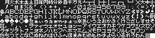
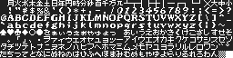

# Free MSX Fonts

Data for MSX -> [MSXFNT/](MSXFNT/)

sample

- font 1  
   Pattern data ```BLOAD"FNT0.PAT",S```  
     
   (additional) Color data ```BLOAD"FNT0.COL",S```  
   
- font 2  
   Pattern data ```BLOAD"FNT1.PAT",S```  
     
   (additional) Color data ```BLOAD"FNT1.COL",S```  
   
- font 3  
   Pattern data ```BLOAD"FNT2.PAT",S```  
     
   (additional) Color data ```BLOAD"FNT2.COL",S```  
   

These fonts is free to use.  
(Free License)
