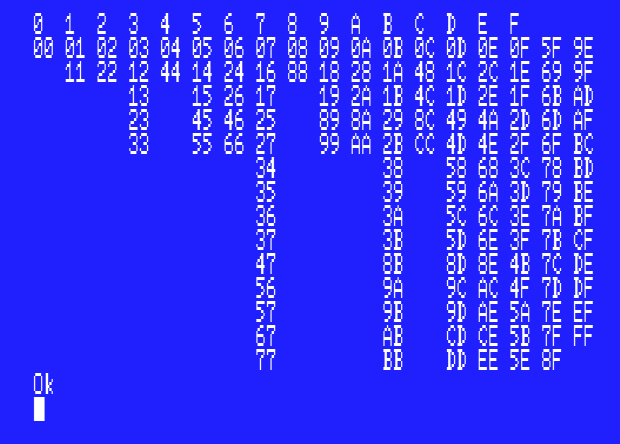

# MSX_MISC_TOOLS

## 他のRepository

|ツール|説明|
|---|---|
| [EXTRACT_MSX_CAS/  ](https://github.com/uniskie/EXTRACT_MSX_CAS/ ) |MSXテープイメージからファイルを取り出す(Python3)

## ブラウザで動作するMSX用ツール
HTML5+javascript ES6 で動作

|ツール|説明|
|---|---|
| [GSRLE/html/](GSRLE/html/) | 【HTML5版 MSX画像ビューア】<br>BSAVE画像やグラフサウルス形式圧縮画像 (派生型ランレングス圧縮)の読み込み・表示・変換・保存が出来るツール<BR> [ブラウザで実行 → https://uniskie.github.io/MSX_MISC_TOOLS/GSRLE/gsrle.html](https://uniskie.github.io/MSX_MISC_TOOLS/GSRLE/gsrle.html) <br>  <BR>MSX上での展開表示は [LOADSRD](LOADSRD)|


## Windowsで動作するMSX用ツール

|ツール|説明|
|---|---|
| [GSRLE/            ](GSRLE             ) |グラフサウルス形式圧縮ツール (派生型ランレングス圧縮)<BR>  <BR>展開表示(MSX用)は [LOADSRD](LOADSRD)|
| [OPLDRV_BGM_EXTRACT/](OPLDRV_BGM_EXTRACT ) |1. FMPACとRTYPEのOPLDRV用BGMデータをカートリッジから取り出すプログラム<br>2. opldrvデータを解析するプログラム <br> |

## Windows向けMSX用お役立ちデータ
|ファイル|説明|
|---|---|
| [Custom Palette for BZ Editor](Custom%20Palette%20for%20BZ%20Editor)|バイナリエディタ Bz Editor 用 MSX Bitmap Palette<BR>|

## MSXで動作するツール

|ツール|説明|
|---|---|
| [FieldWork/          ](FieldWork          ) |高速な漢字テキストエディタ(SCREEN2とスクロール使用)<BR>|
| [LOADSRD/           ](LOADSRD            ) |BSAVE画像とグラフサウルス画像を読み込み表示<BR>(グラフサウルス圧縮対応)<BR>圧縮は [GSRLE](GSRLE)<BR>|
| [SCC_WAVE_MODULATE<br>(他レポジトリ)](https://github.com/uniskie/msx_music_data/tree/master/etc) |SCC波形データのボリューム加工（n/256倍率をかけて出力）<BR>  |
| [BLAUNCH.BAS        ](BLAUNCH.BAS        ) |BASICランチャー：ターボRではCPUモード切替可能<BR>[CPUMODE.ASM](CPU_MODE_FOR_BASIC/CPUMODE.ASM)...機械語部分のソースコード<BR>|
| [FILER.BAS          ](FILER.BAS          ) |ファイル一覧＆ファイル操作プログラム。<BR>ファイル名のひらがな→カタカナ変換可能。<BR>(MSX以外での文字化け対策のため)<BR>|
| [SP-EDIT/           ](SP-EDIT            ) |SCREEN5簡易スプライトエディタ(単色)<BR>|
| [CPU_MODE_FOR_BASIC/](CPU_MODE_FOR_BASIC ) |BASICからCPU MODE(Z80/R800)を切り替えるサンプル<br>|
| [HIMEM.BAS          ](HIMEM.BAS          ) |フリーエリア先頭とスタックポインタのアドレスを表示<BR>|
| [BINADR.BAS         ](BINADR.BAS         ) |BINファイルの先頭アドレスと終端アドレスを表示<BR>|
| [GETPALAD.BAS       ](GETPALAD.BAS       ) |現在の画面モードでのVRAMパレットテーブルを返す(サンプルコード)<BR>|
| [KEYMTX.BAS         ](KEYMTX.BAS         ) |簡易キーマトリクス表示<BR>|
| [KEYMTXB.BAS        ](KEYMTXB.BAS        ) |少しリッチなキーマトリクス表示(turboR推奨)<BR>|
| [COLCOMB.BAS        ](COLCOMB.BAS        ) |簡易スプライトモード2重ね合わせカラーリスト<BR>|
| [COLCOMBG.BAS       ](COLCOMBG.BAS       ) |少しリッチなスプライトモード2重ね合わせカラーリスト<BR>|

### DISKイメージ

githubに直接置いてあるBASICプログラムファイルは、
参照しやすいようにアスキー形式のファイルが殆どになっているため、
MSXでロードする処理がとても遅くなります。

ロードの早い中間言語形式でのBASICファイルはDISKイメージファイルに入っています。

DISKイメージ：[misctool.dsk](misctool.dsk)

内容：
```
BINADR.BAS
BLAUNCH.BAS
COLCOMB.BAS
COLCOMBG.BAS
FAMIMA.BAS
FILER.BAS
GETPALAD.BAS
HIMEM.BAS
KEYMTX.BAS
KEYMTXB.BAS
```


## ご利用について

ソースコードやプログラムの、改変・再配布はご自由にどうぞ。
ただし、サポート・保証などはございません。

ただし、画像についての再利用はご遠慮ください。

このプログラムを使用して起きた問題については補償いたしかねますので、
ファイル・ディスクは常にバックアップを取って使用してください。
