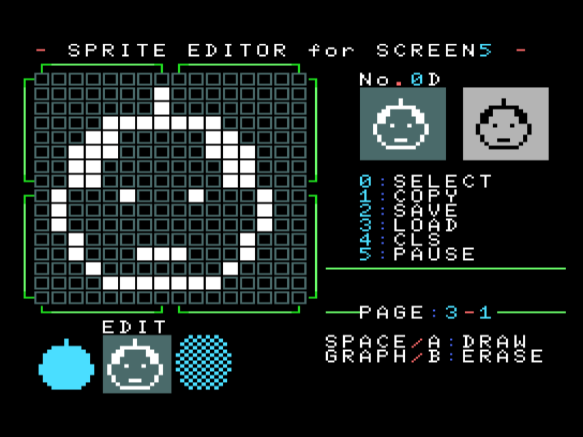
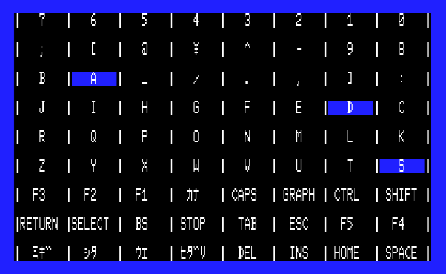
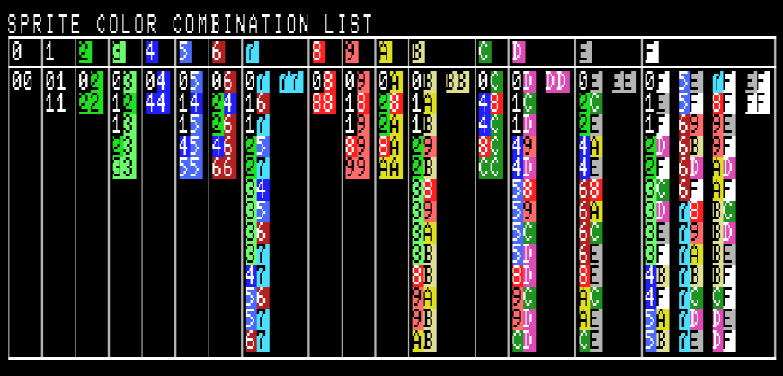

# MSX_MISC_TOOLS

## 他のRepository

|ツール|説明|
|---|---|
| [EXTRACT_MSX_CAS/  ](https://github.com/uniskie/EXTRACT_MSX_CAS/ ) |MSXテープイメージからファイルを取り出す(Python3)

## Windowsで動作するMSX用ツール

|ツール|説明|
|---|---|
| [GSRLE/            ](GSRLE             ) |グラフサウルス形式圧縮ツール (派生型ランレングス圧縮)<BR>  <BR>展開表示(MSX用)は [LOADSRD](LOADSRD)|
| [OPLDRV_BGM_EXTRACT/](OPLDRV_BGM_EXTRACT ) |1. FMPACとRTYPEのOPLDRV用BGMデータをカートリッジから取り出すプログラム<br>2. opldrvデータを解析するプログラム <br> |

## Windows向けMSX用お役立ちデータ
|ファイル|説明|
|---|---|
| [Custom Palette for BZ Editor](Custom%20Palette%20for%20BZ%20Editor)|バイナリエディタ Bz Editor 用 MSX Bitmap Palette<BR>|

## MSXで動作するツール

|ツール|説明|
|---|---|
| [FieldWork/          ](FieldWork          ) |高速な漢字テキストエディタ(SCREEN2とスクロール使用)<BR>|
| [LOADSRD/           ](LOADSRD            ) |BSAVE画像とグラフサウルス画像を読み込み表示<BR>(グラフサウルス圧縮対応)<BR>圧縮は [GSRLE](GSRLE)<BR>|
| [SCC_WAVE_MODULATE<br>(他レポジトリ)](https://github.com/uniskie/msx_music_data/tree/master/etc) |SCC波形データのボリューム加工（n/256倍率をかけて出力）<BR>  |
| [FILER.BAS          ](FILER.BAS          ) |ファイル一覧＆ファイル操作プログラム。<BR>ファイル名のひらがな→カタカナ変換も可能。<BR>(MSX以外での文字化け対策のため)<BR>|
| [SP-EDIT/           ](SP-EDIT            ) |SCREEN5簡易スプライトエディタ(単色)<BR>|
| [CPU_MODE_FOR_BASIC/](CPU_MODE_FOR_BASIC ) |BASICからCPU MODE(Z80/R800)を切り替えるサンプル|
| [HIMEM.BAS          ](HIMEM.BAS          ) |フリーエリア先頭とスタックポインタのアドレスを表示<BR>|
| [BINADR.BAS         ](BINADR.BAS         ) |BINファイルの先頭アドレスと終端アドレスを表示<BR>|
| [GETPALAD.BAS       ](GETPALAD.BAS       ) |現在の画面モードでのVRAMパレットテーブルを返す(サンプルコード)<BR>|
| [KEYMTX.BAS         ](KEYMTX.BAS         ) |簡易キーマトリクス表示<BR>|
| [KEYMTXB.BAS        ](KEYMTXB.BAS        ) |少しリッチなキーマトリクス表示(turboR推奨)<BR>|
| [COLCOMB.BAS        ](COLCOMB.BAS        ) |簡易スプライトモード2重ね合わせカラーリスト<BR>|
| [COLCOMBG.BAS       ](COLCOMBG.BAS       ) |少しリッチなスプライトモード2重ね合わせカラーリスト<BR>|


### 不要かもしれないツール

|ツール|説明|
|---|---|
| [SPCDBL.BAS         ](SPCDBL.BAS         ) |99x8Edit用ツール<BR>(**現在はエクスポート機能が充実しているので不要です**)<BR>スプライトモード2の16x16スプライト用カラーデータをCHR COLOR形式(2倍サイズ)にして出力。<BR><BR>VDPファイルのスプライトカラー情報がCHR COLOR形式のため、エクスポート出力したデータをそのままVDPファイルに書き戻しできないので、このツールで出力したデータをVDPファイルの$1C21～の位置に張り付けるとインポートできます。<BR><BR>***Note***:<br> 出力される```SPCDBL.BIN```は最後に余計な```EOF($1A)```がついてしまいますので、それを取り除いてから貼り付けてください。<BR>|


## ご利用について

ソースコードやプログラムの、改変・再配布はご自由にどうぞ。
ただし、サポート・保証などはございません。

ただし、画像についての再利用はご遠慮ください。

このプログラムを使用して起きた問題については補償いたしかねますので、
ファイル・ディスクは常にバックアップを取って使用してください。
