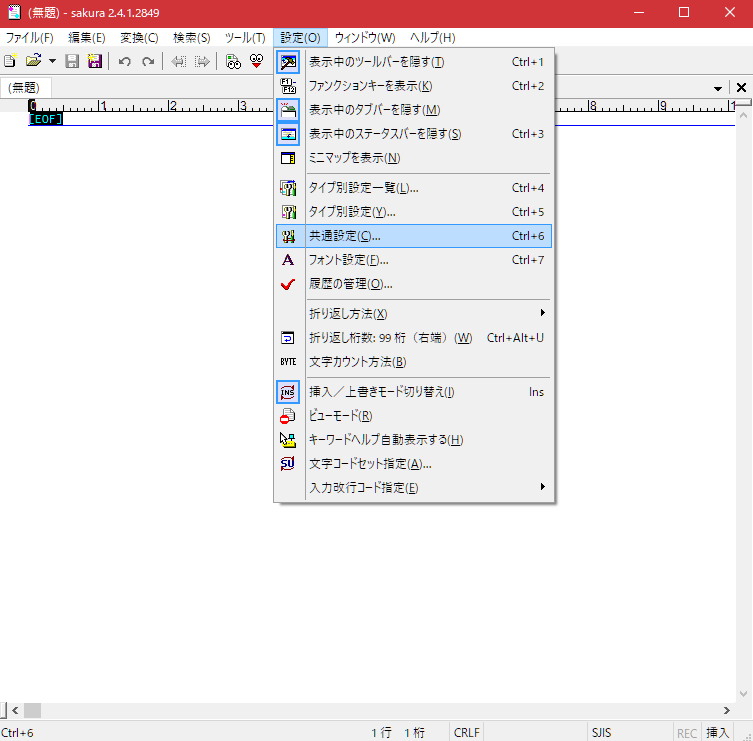
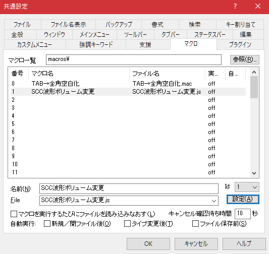
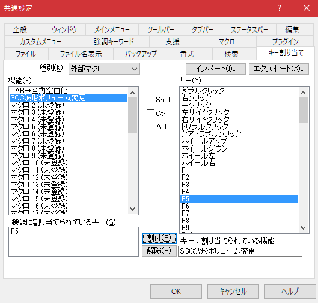

# SCC_WAVE_MODULATE macro

MGSDRV用 SCC波形加工ツール

MGSDRVのMML形式で記述されたSCC波形宣言データ用のを加工し、
n/256倍率をかけた波形データを出力するマクロです。


対応するエディタによって、一般的なフリーウェアであるサクラエディタと、
有料だけど高機能なEmEditor用のマクロを用意してあります。

| Text Editor      | English file name      | 日本語ファイル名           |
|------------------|------------------------|----------------------------|
| for_SakuraEditor | SCC_WAVE_MODULATE.js   | SCC波形ボリューム変更.js   |
| for_EmEditor     | SCC_WAVE_MODULATE.jsee | SCC波形ボリューム変更.jsee |

----------------------------------------------------------------
# 使い方

MGSDRVの波形宣言
```
@s0={ 001931475a6a757d7f7d756a5a47311900 e7cfb9a6968b8380838b96a6b9c7e7 }
```
の後ろに、; 倍率 を書きそのテキストを選択して、マクロを実行します。

```
@s0={ 001931475a6a757d7f7d756a5a47311900 e7cfb9a6968b8380838b96a6b9c7e7 } ; 128
```
倍率は256分の1単位なので128だと半分になります。

実行前


実行後


----------------------------------------------------------------
# マクロの登録方法（サクラエディタ）

1. 設定→共通設定



2. 「マクロ」タブ



	a. マクロのあるフォルダパスを指定
	b. 「名前(N)」を入力
	c. 「File」を選択 （※画像では日本語ファイル名に変えてます）
	d. 「設定(A)」ボタンを押して登録完了

3. 「キー割り当て」タブ



	a. 「種別(K)」で「外部マクロ」を選択
	b. 指定したいマクロを選んでキーを割り当てる

全ての設定が終わったら「OK」ボタンで閉じる

----------------------------------------------------------------
# マクロの実行（サクラエディタ）

1. キー割り当てした場合はそのキーを押す

2. 「ツール(T)」→「登録済みマクロ(b)」から実行する

	


