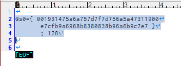

# SCC_WAVE_MODULATE macro

MGSDRV用 SCC波形加工ツール

MGSDRVのMML形式で記述されたSCC波形宣言データ用のを加工し、
n/256倍率をかけた波形データを出力するマクロです。


対応するエディタによって、一般的なフリーウェアであるサクラエディタと、
有料だけど高機能なEmEditor用のマクロを用意してあります。

| Text Editor      | English file name      | 日本語ファイル名           |
|------------------|------------------------|----------------------------|
| for_SakuraEditor | SCC_WAVE_MODULATE.js   | SCC波形ボリューム変更.js   |
| for_EmEditor     | SCC_WAVE_MODULATE.jsee | SCC波形ボリューム変更.jsee |

# 使い方

MGSDRVの波形宣言
```
@s0={ 001931475a6a757d7f7d756a5a47311900 e7cfb9a6968b8380838b96a6b9c7e7 }
```
の後ろに、; 倍率 を書きそのテキストを選択して、マクロを実行します。

```
@s0={ 001931475a6a757d7f7d756a5a47311900 e7cfb9a6968b8380838b96a6b9c7e7 } ; 128
```
倍率は256分の1単位なので128だと半分になります。

実行前


実行後


