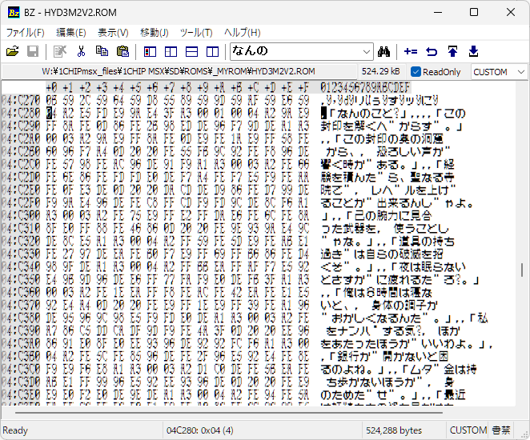

# bmp2ttf2 取扱説明書

画像（BMP / PNG等）に並べられたビットマップパターンから等幅の TrueType フォント（`.ttf`）を生成するツールです。

一般的な画像グリッドからの文字切り出し機能に加え、Unicode の私用領域（外字領域）へ独自のフォントを取り込み、定義ファイル（`.def`）を用いて任意の通常文字（ASCII、ひらがな、カタカナ、漢字等）へマッピングして利用できる機能を備えています。

---

## 配布形式と動作環境

本ツールは **Windows向け実行ファイル（`.exe`）** と **Python スクリプト（`.py`）** の両方を同梱しています。

### 1. exe 版を利用する場合
- Python 等の環境構築は不要です。そのままコマンドプロンプトや PowerShell から実行できます。
- コマンド例における `python bmp2ttf2.py` を `bmp2ttf2.exe` に読み替えて実行してください。

### 2. Python スクリプト版を利用する場合
- Python 3.10 以上
- 必要ライブラリ:
  ```bash
  pip install pillow fonttools
  ```

---

## 基本的な使用方法

コマンドライン引数で直接指定する方法と、設定ファイル（JSON）を指定する方法の2通りがあります。

### CLI から直接実行する
```bash
bmp2ttf2.exe -o output.ttf -s "font.png:0,0,256,48:8,16:0x0020" -s "font.png:0,48,256,688:16,16:0x3040"
```

### JSON 設定ファイルを指定して実行する（推奨）
```bash
bmp2ttf2.exe -c config.json -o output.ttf
```

---

## 画像の切り出し仕様（セル間隔と有効サイズ）

文字ごとの間隔（ピッチ）と、実際に文字として切り出す領域サイズを個別に指定できます。

- **書式（CLI）**: `間隔幅,間隔高[/有効幅,有効高]` （例: `16,16` または `16,16/8,16`）
- **書式（JSON）**: `"step_size": [16, 16], "glyph_size": [8, 16]`

```text
■: セル間隔 (step_size: 16x16)
□: 有効サイズ (glyph_size: 8x16)

┌───────┬───────┐
│□□□□  │       │  ← 16x16 の枠の左側 8x16 のみを取得し、
│□□□□  │       │     フォントの送り幅（Advance Width）も
│□□□□  │       │     半角幅（全角の50%）として登録
└───────┴───────┘
```
- 間隔と有効サイズが同一の場合は有効サイズの指定を省略できます（`glyph_size` を省略すると `step_size` と同じになります）。

---

## 外字登録と文字マップ機能（.def ファイル）

ビットマップから取り込んだ文字を Unicode の私用領域（外字領域: 例 `0xE000`〜）に配置し、定義ファイル（`.def`）に基づいて通常の文字コードへマッピング（二重割り当て）します。

```text
[画像から取得] ──> 外字領域 (U+E000〜) に登録
                         │
                         ▼  (定義ファイルに基づいてマッピング)
                   通常文字 (ASCII, かな, 漢字等) でも入力・表示可能に
```

### マッピングの有効化
- 定義ファイルを指定するだけではマッピングは行われません。必ず `--enable-charmap`（または JSON の `"enable_charmap": true`）を指定してください。
- ファイル指定を省略して有効化フラグのみを指定した場合は、標準の MSX 1バイト文字互換マップが適用されます。

```bash
# 外部定義ファイルを使用
bmp2ttf2.exe -c config.json --enable-charmap -cm char_map_hydlide3_main.def

# 組み込みデフォルト定義を使用
bmp2ttf2.exe -c config.json --enable-charmap
```

---

## 定義ファイル（.def）の書式仕様

行単位のテキストファイルです。各行で「開始オフセット」と「配置する文字列」を指定します。

```text
; セミコロンで始まる行はコメント
+20	 !"#$%&'()*+,-./0123456789:;<=>?
+40	@ABCDEFGHIJKLMNOPQRSTUVWXYZ[¥]^
100	悪宿扱安暗闇以偉慰異移敵一印飲院
```

### 構文規則

1. **オフセットと文字列の区切り**:
   - 必ず **タブ文字（`\t`）1文字** で区切ってください（スペース区切りは無効です）。
2. **開始オフセットの指定**:
   - **16進数** で指定します。
   - 先頭の `+` 記号は**あっても無くても構いません**（`+20`, `20`, `+100`, `100` のいずれも有効）。
   - 指定したオフセット値から、タブ以降の文字列が 1 文字ずつ順番に配置されます。
   - 途中のオフセットが飛んでいる場合は未定義（スキップ）として扱われます。
   - 要素数に 0xFF（256文字）等の制限はなく、漢字などの大きなオフセット（`+100` 以降など）も制限なく定義できます。
3. **エスケープシーケンス**:
   - `\` によるエスケープが有効です（`\u0000`, `\t`, `\"`, `\\` 等）。
4. **コメント・空行**:
   - 行頭が `;`（セミコロン）の行、および空行は無視されます。

---

## オプション・パラメータ一覧

### コマンドライン引数 (CLI)

| オプション | 引数 | 説明 |
| :--- | :--- | :--- |
| `-o`, `--output` | ファイル名 | 出力先 TTF ファイル名（デフォルト: `output.ttf`） |
| `-n`, `--name` | 文字列 | フォント名（デフォルト: `MSX-Font`） |
| `-c`, `--config` | パス | 設定用 JSON ファイルのパス |
| `-s`, `--set` | 書式指定 | 画像セット指定: `画像パス:x1,y1,x2,y2:間隔[/有効]:開始コード` |
| `--em` | 整数 | EM値（16〜16384、デフォルト: `1024`） |
| `-b`, `--baseline` | 比率 | ベースライン比率（例: `1/8` または `0.125`、デフォルト: `1/8`） |
| `-m`, `--margin` | 比率 | 上下共通の余白比率（例: `1/8`） |
| `-mt`, `--margin-top` | 比率 | 上余白比率 |
| `-mb`, `--margin-bottom` | 比率 | 下余白比率 |
| `--scale-copy` | なし | 横50%縮小コピーを実行するフラグ |
| `--scale-copy-src` | コード | 縮小コピー元の開始コードポイント（デフォルト: `0xE000`） |
| `--scale-copy-dst` | コード | 縮小コピー先の開始コードポイント（デフォルト: `0xE100`） |
| `--scale-copy-count` | 整数 | 縮小コピーする文字数（デフォルト: `256`） |
| `--enable-charmap` | なし | 文字マップによる Unicode へのマッピングを有効化 |
| `-cm`, `--charmap-file` | パス | 文字マップ定義ファイル（`.def`）のパス |
| `--charmap-source` | コード | 文字マップが参照する外字の開始コードポイント（デフォルト: `0xE100`） |

---

## JSON 設定ファイル仕様

```json
{
  "name": "MyFont",
  "em": 1024,
  "baseline": "1/8",
  "margin": 0.0,
  "sets": [
    {
      "image": "font.png",
      "bbox": [0, 0, 256, 48],
      "step_size": [8, 16],
      "start_cp": "0xE020"
    },
    {
      "image": "font.png",
      "bbox": [0, 48, 256, 688],
      "step_size": [16, 16],
      "start_cp": "0xE080"
    }
  ],
  "enable_charmap": true,
  "charmap_file": "char_map_normal.def",
  "charmap_source": "0xE000"
}
```

### `sets` 内の指定項目

- `image` (必須): 画像ファイルパス。
- `step_size` または `cell_size` (必須): `[幅, 高さ]` のセル間隔ピッチ。
- `glyph_size` (任意): `[幅, 高さ]` の切り出し・送り幅サイズ。省略時は `step_size` と同値。
- `bbox` (任意): 画像内の走査領域 `[x1, y1, x2, y2]`。省略時は画像全体。
- `start_cp` (必須): 開始コードポイント（`"0xE000"`, `57344` 等）。

---

## 【実践例】ハイドライド3（MSX2版）フォントの生成

ハイドライド3のメッセージシステムは独自のマルチバイト体系を持っています。
- 基本コード: `20H` 〜 `FFH`
- 拡張文字（漢字等）: `FEH` と `FFH` をプレフィックスとし、それぞれ 256 文字分の拡張コード領域を持ちます。

同梱の `hydlide3_msx2.bat` では
1. [`pat2bmp`](./pat2bmp.md)を使用して、`HYDL3MSX2.ROM` から `hydlide3_msx2_font.bmp` （幅256 × 高さ688 ピクセル）を作成し、
2. 次に [`bmp2ttf2`](./bmp2ttf2.md) を使用して、`hydlide3_msx2_font.bmp` と `char_map_hydlide3_main.def` を渡してTrueTypeフォント(ttfファイル)を生成します。


### hydlide3_msx2.bat
```
@set rom=hyd3m2v2.rom
@set bmp=hydlide3_msx2_font.bmp
@set cfg=hydlide3_msx2_font_extract.cfg
@set json=hydlide3_msx2.json
py pat2bmp.py %rom% %bmp% -c %cfg% --vscale 2
py bmp2ttf2.py -c %json%
timeout /t 5
```

### pat2bmp用 設定ファイル （`hydlide3_msx2_font_extract.cfg`）

書式：[pat2bmp.md](./pat2bmp.md) を参照

```
# =============================================================================
# フォント定義ファイル (fonts.cfg)
#
# 書式: 開始アドレス, 文字数, ビット形式
#
# ・開始アドレス: 16進数 (0x2B400 または 2B400H) / 10進数
# ・文字数      : 10進数 / 乗算式 (例: 256*2)
# ・ビット形式  : 8x8, 16x8, 8x8x2
# ・コメント    : '#' または ';' 以降はすべてコメント
# =============================================================================

# アスキーコード 20H～7FH (96文字, 8x8)
2B400H,  96,    8x8

# MSXアスキーコード 80H～FFH (計128文字)
# ※ DEH, DFH (濁点・半濁点) は 8x8x2 形式
2B700H,  94,    16x8    ; 80H～DDH (通常16x8)
2BCE0H,  2,     8x8x2   ; DEH～DFH (濁点・半濁点: 8x8タイル×2)
2BD00H,  32,    16x8    ; E0H～FFH (通常16x8)

# 漢字ブロック (256*2個, 16x8)
7E000H,  256*2, 16x8    # 16x16行 * 2ブロック
```

### hydlide3_msx2_font.bmp のレイアウト構成

| 領域（Y座標） | 内容 | セル仕様 (幅×高) | 文字数 | コード範囲 |
| :--- | :--- | :--- | :--- | :--- |
| `0` 〜 `48` (3行) | 半角英数記号 | **8×16** (32文字/行) | 96文字 | `0x20` 〜 `0x7F` |
| `48` 〜 `176` (8行) | 全角かな・記号 | **16×16** (16文字/行) | 128文字 | `0x80` 〜 `0xFF` |
| `176` 〜 `432` (16行) | 拡張文字 [FEH] | **16×16** (16文字/行) | 256文字 | `0x100` 〜 `0x1FF` |
| `432` 〜 `688` (16行) | 拡張文字 [FFH] | **16×16** (16文字/行) | 256文字 | `0x200` 〜 `0x2FF` |

全グリフを外字領域 `0xE000` 基準（`+20` は `0xE020`、`+80` は `0xE080`、`+100` は `0xE100`、`+200` は `0xE200`）へ取り込み、`.def` ファイルによって Unicode（ASCII、ひらがな、カタカナ、漢字）へ割り当てます。

### bmp2ttf用 設定ファイル （`hydlide3_msx2.json`）

```json
{
  "name": "Hydlide3-MSX2",
  "em": 2048,
  "baseline": "1/8",
  "margin": "1/8",
  "sets": [
    {
      "image": "hydlide3_msx2_font.bmp",
      "bbox": [0, 0, 256, 48],
      "step_size": [8, 16],
      "start_cp": "0xE020",
    },
    {
      "image": "hydlide3_msx2_font.bmp",
      "bbox": [0, 48, 256, 176],
      "step_size": [16, 16],
      "start_cp": "0xE080",
    },
    {
      "image": "hydlide3_msx2_font.bmp",
      "bbox": [0, 176, 256, 432],
      "step_size": [16, 16],
      "start_cp": "0xE100",
    },
    {
      "image": "hydlide3_msx2_font.bmp",
      "bbox": [0, 432, 256, 432],
      "step_size": [16, 16],
      "start_cp": "0xE200",
    },
  ],
  "enable_charmap": true,
  "charmap_file": "char_map_hydlide3_main.def",
  "charmap_source": "0xE000",
}
```

### バイナリエディターBZ CUSTOMエンコード対応版(1.9.9.7以降)

[BinaryEditorBz_for_MSX](https://raw.githubusercontent.com/uniskie/MSX_MISC_TOOLS/refs/heads/main/BinaryEditorBz_for_MSX/)



### bmp2ttf 実行部

```bash
# exe 版の場合
bmp2ttf2.exe -c hydlide3_msx2.json -o Hydlide3-MSX2.ttf

# Python 版の場合
python bmp2ttf2.py -c hydlide3_msx2.json -o Hydlide3-MSX2.ttf
```

生成された `Hydlide3-MSX2.ttf` をインストールすることで、ハイドライド3（MSX2版）の半角英数（8×16）、かな・記号、およびゲーム内で使用されている全漢字（16×16）が通常のキーボード入力・テキスト表示で利用可能になります。

---

## ライセンス

本プログラムのソースコード（`bmp2ttf2.py`）は完全にフリーです。商用・非商用を問わず、改変・再配布・流用等、用途に制限なく自由にご利用いただけます。

生成されたフォントファイルの著作権および利用条件は、入力として使用したビットマップ画像の権利規約に準拠します。
