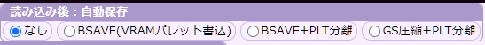

# MSX画像ビューア ブラウザ版

SCREEN2～SCREEN12の画像を表示・変換保存可能なツールです。

GSRLEのブラウザ版を作成しようとしたら、いつの間にかこうなっていました。

- SCREEN 2～SCREEN 12のMSX画像ファイルに対応
- BSAVE形式、グラフサウルス圧縮形式の読み込み表示
- BSAVE形式、グラフサウルス圧縮形式での保存
- インターレース画像対応（SCREEN5以上）

ソースコード  
[https://github.com/uniskie/MSX_MISC_TOOLS/tree/main/GSRLE/html](https://github.com/uniskie/MSX_MISC_TOOLS/tree/main/GSRLE/html)

## github pages の WEBページでブラウザから直接実行

[https://uniskie.github.io/MSX_MISC_TOOLS/GSRLE/gsrle.html](https://uniskie.github.io/MSX_MISC_TOOLS/GSRLE/gsrle.html)

github pagesはdocsフォルダに手作業で移動しているので、更新は遅れるかもしれません。

## MSX実機でのロード

ローダーのサンプルがあります。

[https://github.com/uniskie/MSX_MISC_TOOLS/tree/main/LOADSRD](https://github.com/uniskie/MSX_MISC_TOOLS/tree/main/LOADSRD)

ビューアー・ローダーともに、
ソースコードの再利用はご自由にどうぞ。

## MSX画像の圧縮・展開 保存機能

読み込み済みファイルがあれば保存・圧縮保存が可能です。

また、表示されている画像を右クリックすると、ブラウザの機能を使ってPNGなどの画像として保存できます。

| ボタン名 | 説明 | 補足 |
|---|---|---|
| PLT保存 | カラーパレットデータを保存します | グラフサウルスと違い、スロット1本分の32バイトのファイルです。 |
| BSAVE保存 (パレット込み) | カラーパレットを含む BSAVEベタ形式保存 | VRAMパレットテーブルに現在のパレットを書き込みます。 保存サイズがVRAMパレットテーブルより小さければ、テーブルを含む領域まで保存します。|
| BSAVE保存 (画素のみ) | カラーパレットを含まない BSAVEベタ形式保存 | VRAMパレットテーブルにパレットを書き込みません。 VRAMパレットテーブルを考慮せず、ピクセルデータの範囲までを保存します。|
| GS圧縮保存 (画素のみ) | カラーパレットを含まない グラフサウルス圧縮形式保存 | VRAMパレットテーブルにパレットを書き込みません。 VRAMパレットテーブルを考慮せず、ピクセルデータの範囲までを保存します。|
 

## PNGやBMPからの変換

本ツールにはMSX画像形式からの圧縮や展開のみをサポートしています。  
PNGなどからの変換機能が欲しい場合は他のツールを使用してください。

- BMP to MSX  
  自分が良く使用しているのは、hra1129さんの変換ツール  BMP to MSX です。  
  [https://github.com/hra1129/bmp2msx](https://github.com/hra1129/bmp2msx)

- その他ツール紹介ページ  
  [Gigamax Online Webアプリ多め！ネットで見つけたMSX向け画像編集ツールまとめ](https://gigamix.hatenablog.com/entry/devmsx/graphics-tools#MSX-Screen-Converter%E3%82%AA%E3%83%B3%E3%83%A9%E3%82%A4%E3%83%B3-MSX%E5%90%91%E3%81%91%E5%90%84%E7%A8%AE%E7%94%BB%E5%83%8F%E3%82%B3%E3%83%B3%E3%83%90%E3%83%BC%E3%82%BF)

## 設定：読み込み後自動保存

画像の読み込みが終わった後に指定の形式で自動保存するオプション

| 形式 | 内容 | パレットデータ |
|---|---|---|
| BSAVE(FULL) | BSAVE形式（VRAMカラーパレットテーブルを含む）画像ファイル | BSAVEファイルに含む ||
| BSAVE(画素のみ)+PLT | BSAVE形式（VRAMカラーパレットテーブルを含まない）画像ファイルと、PLTファイルのセット | PLTファイル |
| GS圧縮(画素のみ)+PLT | グラフサウルス圧縮形式画像ファイルと、PLTファイルのセット | PLTファイル |

## 対応拡張子

拡張子で判定して、インターレースモードでの読込先ページを決定します。

1. パレットの有無、画面サイズ、圧縮などはデータの内容を見て判定します。
2. SC1はSSCREEN12のインターレース画像として扱います。
3. SCREEN1画像の場合、SC1の代わりにSR1を使用してみてください。
4. SCREEN 9は未テストです。
5. 保存時は現在表示している縦サイズで保存します。

| 拡張子 | SCREEN番号 | インターレースモード | BSAVE拡張子 | GS拡張子 | 補足 |
|---|---|---|---|---|---|
| .SC2 | SCREEN  2 | non-interlace    | .SC2 |.SR2 | BSAVE
| .SC3 | SCREEN  3 | non-interlace    | .SC3 |.SR4 | BSAVE
| .SC4 | SCREEN  4 | non-interlace    | .SC4 |.SR3 | BSAVE
| .SC5 | SCREEN  5 | non-interlace    | .SC5 |.SR5 | BSAVE
| .SC6 | SCREEN  6 | non-interlace    | .SC6 |.SR6 | BSAVE
| .SC7 | SCREEN  7 | non-interlace    | .SC7 |.SR7 | BSAVE
| .SC8 | SCREEN  8 | non-interlace    | .SC8 |.SR8 | BSAVE
| .S10 | SCREEN 10 | non-interlace    | .S10 |.SRA | BSAVE
| .S12 | SCREEN 12 | non-interlace    | .S12 |.SRC | BSAVE
| .S50 | SCREEN  5 | interlace page:0 | .S50 |.R50 | BSAVE interlace
| .S51 | SCREEN  5 | interlace page:1 | .S51 |.R51 | BSAVE interlace
| .S60 | SCREEN  6 | interlace page:0 | .S60 |.R60 | BSAVE interlace
| .S61 | SCREEN  6 | interlace page:1 | .S61 |.R61 | BSAVE interlace
| .S70 | SCREEN  7 | interlace page:0 | .S70 |.R70 | BSAVE interlace
| .S71 | SCREEN  7 | interlace page:1 | .S71 |.R71 | BSAVE interlace
| .S80 | SCREEN  8 | interlace page:0 | .S80 |.R80 | BSAVE interlace
| .S81 | SCREEN  8 | interlace page:1 | .S81 |.R81 | BSAVE interlace
| .SA0 | SCREEN 10 | interlace page:0 | .SA0 |.RA0 | BSAVE interlace
| .SA1 | SCREEN 10 | interlace page:1 | .SA1 |.RA1 | BSAVE interlace
| .SC0 | SCREEN 12 | interlace page:0 | .SC0 |.RC0 | BSAVE interlace
| .SC1 | SCREEN 12 | interlace page:1 | .SC1 |.RC1 | BSAVE interlace
| .SR2 | SCREEN  2 | non-interlace    | .SC2 |.SR2 | GRAPH SAURUS
| .SR4 | SCREEN  3 | non-interlace    | .SC3 |.SR4 | GRAPH SAURUS
| .SR3 | SCREEN  4 | non-interlace    | .SC4 |.SR3 | GRAPH SAURUS
| .SR5 | SCREEN  5 | non-interlace    | .SC5 |.SR5 | GRAPH SAURUS
| .SR6 | SCREEN  6 | non-interlace    | .SC6 |.SR6 | GRAPH SAURUS
| .SR7 | SCREEN  7 | non-interlace    | .SC7 |.SR7 | GRAPH SAURUS
| .SR8 | SCREEN  8 | non-interlace    | .SC8 |.SR8 | GRAPH SAURUS
| .SRA | SCREEN 10 | non-interlace    | .S10 |.SRA | GRAPH SAURUS
| .SRC | SCREEN 12 | non-interlace    | .S12 |.SRC | GRAPH SAURUS
| .SRS | SCREEN 12 | non-interlace    | .S12 |.SRS | GRAPH SAURUS
| .R50 | SCREEN  5 | interlace page:0 | .S50 |.R50 | GRAPH SAURUS interlace
| .R51 | SCREEN  5 | interlace page:1 | .S51 |.R51 | GRAPH SAURUS interlace
| .R60 | SCREEN  6 | interlace page:0 | .S60 |.R60 | GRAPH SAURUS interlace
| .R61 | SCREEN  6 | interlace page:1 | .S61 |.R61 | GRAPH SAURUS interlace
| .R70 | SCREEN  7 | interlace page:0 | .S70 |.R70 | GRAPH SAURUS interlace
| .R71 | SCREEN  7 | interlace page:1 | .S71 |.R71 | GRAPH SAURUS interlace
| .R80 | SCREEN  8 | interlace page:0 | .S80 |.R80 | GRAPH SAURUS interlace
| .R81 | SCREEN  8 | interlace page:1 | .S81 |.R81 | GRAPH SAURUS interlace
| .RA0 | SCREEN 10 | interlace page:0 | .SA0 |.RA0 | GRAPH SAURUS interlace
| .RA1 | SCREEN 10 | interlace page:1 | .SA1 |.RA1 | GRAPH SAURUS interlace
| .RC0 | SCREEN 12 | interlace page:0 | .SC0 |.RC0 | GRAPH SAURUS interlace
| .RC1 | SCREEN 12 | interlace page:1 | .SC1 |.RC1 | GRAPH SAURUS interlace

## 更新履歴

- 2023/09/05
  - SCREEN2～4の画像保存が正常動作しないのを修正。
  - こっそりSCREEN0と1に対応。
  - こっそりGEN、COL、NAM、PATなどのVRAM部分セーブファイルに対応。
    - 扱いはSCREEN2画像
    - 部分ファイルはメインファイル名として記録されないのでメイン画像がないと保存出来ない。  
      （※TEST.SC2などのSCREEN2全体画像を読み込んだ後に部分データを読み込むとセーブ可能）

- それ以前
  - 何か色々修正
