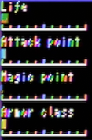
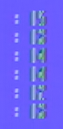
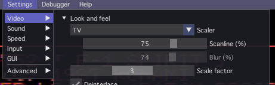
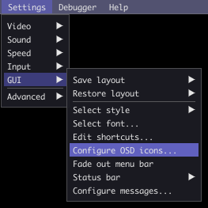
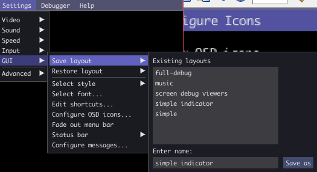

# OpenMSX custom data

| folder | items  |
|---|---|
|[msx_softwaredb_xml_merge](msx_softwaredb_xml_merge)|`softearedb.xml`の加工（追加合成）ツールです。足りないROM情報を追加したいときに使います。|
|[share/scripts](share/scripts)| カスタムコマンド追加サンプルです。 |
|[share/skins](share/skins)| skins/uni-set ... 少し小さめのOnScreenDisplayアイコンセットです。 |
|[share/shader](share/shader)| TVシェーダーをNTSC滲み風に変えるシェーダーです。|
|[layouts](layouts)| skins/uni-setのアイコンを使用したレイアウト保存データです。 openMSXメニューの 「Settings」 → 「GUI」→「Save Layout」で保存、「Restore Layout」で呼び出し。 |

## 使い方

`ユーザーフォルダ/openMSX/share/`
にsciptフォルダやskinフォルダをコピーして使用してください。

> - windows: `%USERPROFILE%\My Documents\openMSX\share`  
> - unix: `~/.openMSX/share`  
>
> (openMSX環境変数 [var(OPENMSX_USER_DATA)] で取得可能) 

もし同名のファイルがある場合は上書しないで名前を変えて使用してください。

## script 解説

share/scriptの中にあるファイルのうち、頭に_（アンダースコア）が付いていない*.tclファイルが起動時に読み込み・実行されます。

OpenMSXコマンドコンソールから使用したいものは、
頭に_のついたtclファイルに書き、
`lazy_add.tcl`の中で登録するという流れになります。

- lazy_add.tcl  
  起動時に実行されます。  
  `_bmp_util.tcl`の中にある`save2bmp`というコマンドを登録します。  

- _bmp_util.tcl  
  `save2bmp`というコマンドのヘルプテキストや処理内容を定義しています。

- _disasm3.tcl  
  `disasm3`や`get_symbol`というコマンドのヘルプテキストや処理内容を定義しています。  
  `disasm3`は[disasm2](https://www.msx.org/forum/msx-talk/openmsx/openmsx-disasm)をベースに拡張した自分用逆アセンブル出力コマンドです。  

  1. 開始アドレス、終了アドレスで範囲を指定
  2. Symbol Managerを参照してラベルに対応
  3. ダンプをコメントとして追加
  4. 開始・終了アドレスの指定にラベル対応（※大文字小文字の区別有り）
  5. 終了アドレスに相対指定追加。（`+数値` を指定すると相対アドレス≒サイズ指定）

  （`disasm3_l`はおまけ。ラベル対応1行逆アセンブル）
  
  `save_to_file {sample.asm} [disasm3 0x0000 0x3fff]`⏎ のようにすると逆アセンブル結果出力をファイルに保存できます。

### コマンドコンソール（tcl/tkコンソール）の簡単なTIPS

- カレントディレクトリの取得は`pwd⏎`  
- カレントディレクトリの変更は`cd パス⏎`

- Windowsのパス区切り文字列\などを使った指定の場合、
  エスケープシーケンスを無効化して文字列そのものを指定するほうが楽です。  
  その場合はパスを{}で囲んで指定します。  
  例) `cd {C:\GitHub\_uniskie\MSX_MISC_TOOLS\openMSX_custom}`
 
-  環境変数などを使用する場合は`{}`で囲まず  
  `cd $env(OPENMSX_USER_DATA)/../`  
  のような感じで `\`の代わりに`/`を使うと楽です。
  
  そのほかのTIPSは書きかけですが、
  [MSX_DOCUMENTS Repositryの openMSX Tclスクリプト活用ガイド](https://github.com/uniskie/MSX_DOCUMENTS/blob/main/OpenMSX_script/openMSX%20Tcl%E3%82%B9%E3%82%AF%E3%83%AA%E3%83%97%E3%83%88%E6%B4%BB%E7%94%A8%E3%82%AC%E3%82%A4%E3%83%89.md) を参照ください。

## shader 解説

### TV Shader Custom

公式版のTVフィルタをNTSC（Compsite VIDEO）風のにじみのある映像に変更するshaderです。  
Themaister's NTSC shaderベースの処理を移植したもので、アナログテレビ風のにじみに少し近くなります。

#### Themaister's NTSC shader

表示時に一度NTSC信号に変換し、
クロスカラー(色の干渉)やドット妨害(暗いドット)の処理を施した後、
RGBに戻して表示する物です。

- クロスカラー  
  

- ドット妨害  
  

### VIDEO設定

Settings→Video→Scalerを「TV」に変更すると反映されます。

明るい色ほどスキャンラインの隙間に滲み出す処理も入っているので、
個人的なおすすめはScanline 75%です。

*※注) TVフィルタでは、Scanlineは反映されますが、Blurは無視されます。*

詳細は[share/shader/ReadMe.md](share/shader/ReadMe.md)を参照してください。

## skin 解説

### skins/uni-set

少し小さめのOnScreenDisplayアイコンセットです

openMSXメニューの 「Settings」 → 「GUI」 → 「Configure OSD icons...」でアイコンを指定してください。

## GUIレイアウト

- layouts/simple.ini
- layouts/debug.ini

各iniファイルを`ユーザーフォルダ/openMSX/layouts`に置いてください。

> - windows: `%USERPROFILE%\My Documents\openMSX\layouts`  
> - unix: `~/.openMSX/layouts`  

skins/uni-setの小さめなアイコンを使用したレイアウト定義です。

openMSXメニューの 「Settings」 → 「GUI」→  
「Save Layout」で保存、「Restore Layout」で呼び出し。

